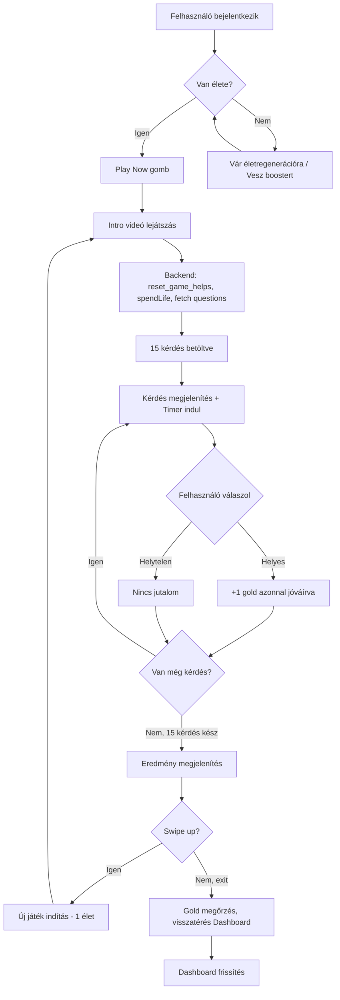
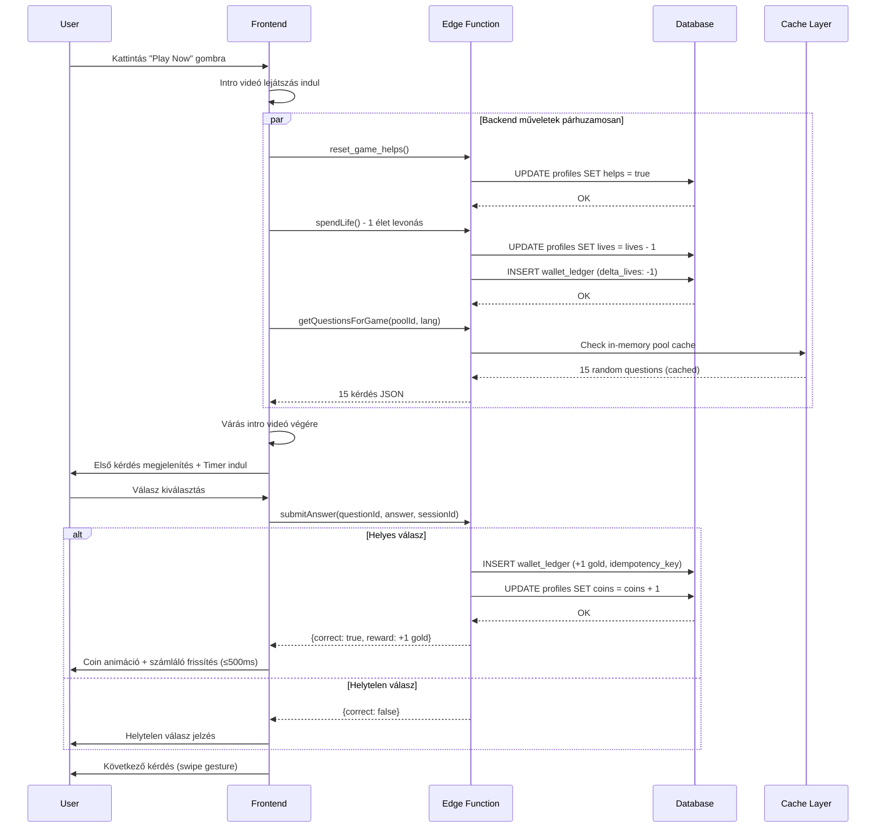
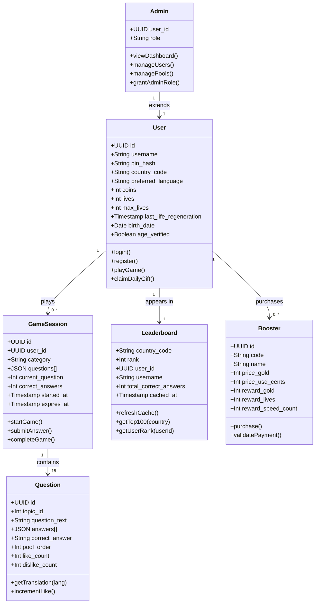
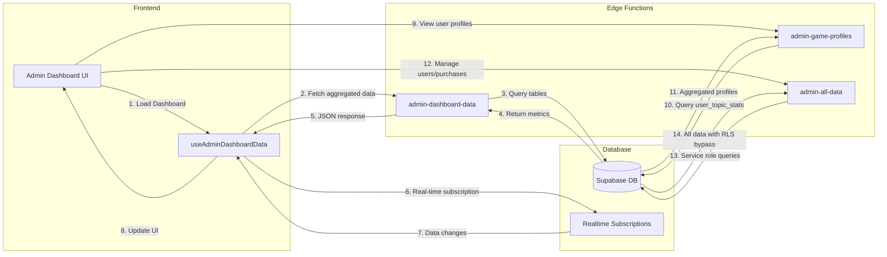
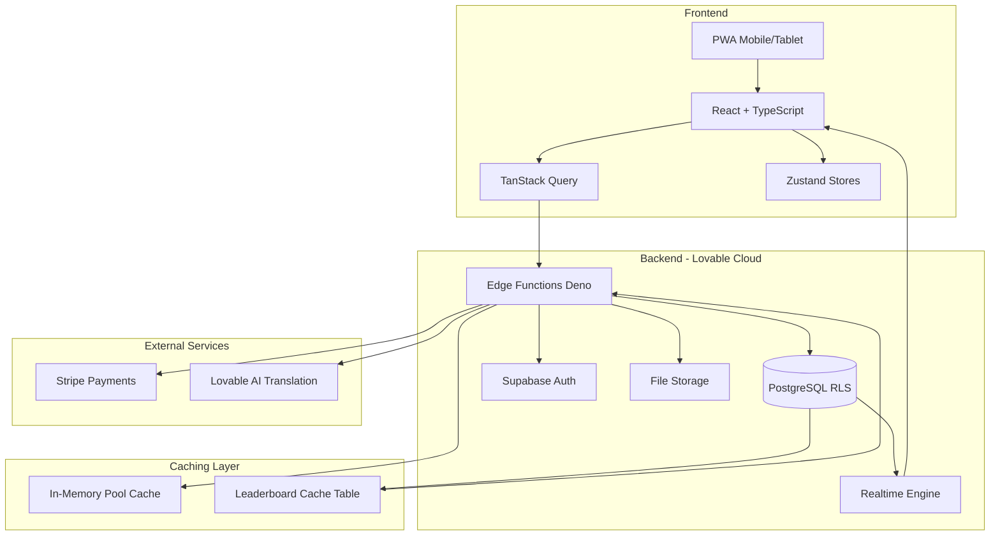

# DingleUP! - Architektúra Dokumentáció

## 1. Activity Diagram - Játék Flow

## 2. Use Case Diagram - Főbb Funkciók

```mermaid
graph TB
    subgraph Felhasználó
        U[Felhasználó]
    end
    
    subgraph Admin
        A[Admin]
    end
    
    subgraph System
        S[Automatikus Rendszer]
    end
    
    U --> UC1[Regisztráció + Életkor ellenőrzés]
    U --> UC2[Bejelentkezés Username+PIN / Biometria]
    U --> UC3[Játék indítás 15 kérdéssel]
    U --> UC4[Kérdés megválaszolás]
    U --> UC5[Lifeline használat]
    U --> UC6[Daily Gift átvétel]
    U --> UC7[Welcome Bonus átvétel]
    U --> UC8[Booster vásárlás Free/Premium]
    U --> UC9[Ranglista megtekintés országonként]
    U --> UC10[Profil szerkesztés]
    U --> UC11[Nyelv váltás]
    
    A --> UC12[Admin Dashboard megtekintés]
    A --> UC13[Felhasználók kezelése]
    A --> UC14[Kérdés poolok kezelése]
    A --> UC15[Analitika dashboardok]
    A --> UC16[Admin jogosultság kiosztás]
    A --> UC17[Fordítások kezelése]
    
    S --> UC18[Élet regeneráció 12 percenként]
    S --> UC19[Napi ranglista snapshot éjfélkor]
    S --> UC20[Napi nyertesek jutalmak kiosztása]
    S --> UC21[Real-time leaderboard frissítés]
```

## 3. Sequence Diagram - Játék Indítás

## 4. Class Diagram - Főbb Entitások

## 5. Design Patterns Alkalmazása

### 5.1 Repository Pattern
**Implementáció:** Supabase Edge Functions + Database
- Összes adatelérés központosítva edge function-ökben
- Példák: `get-wallet`, `complete-game`, `get-game-questions`
- Előny: Backend logika elkülönítve, RLS policies érvényesítve

### 5.2 Observer Pattern (Pub/Sub)
**Implementáció:** Supabase Realtime + React Query
- Real-time subscriptions: `profiles`, `wallet_ledger`, `leaderboard_cache`
- Frontend komponensek automatikusan frissülnek adatváltozáskor
- Példa: Wallet polling (5s) + realtime updates

### 5.3 Strategy Pattern
**Implementáció:** Payment módszerek (Free vs Premium Booster)
- `purchase-booster` edge function különböző fizetési stratégiák
- Free booster: gold levonás
- Premium booster: Stripe payment validation

### 5.4 Singleton Pattern
**Implementáció:** Supabase Client
- `src/integrations/supabase/client.ts` egyetlen példány
- Minden komponens ugyanazt a client instance-t használja

### 5.5 Factory Pattern
**Implementáció:** Question Pool Generation
- `regenerate-question-pools` edge function
- Dinamikusan generál 15 poolt 30 topicból
- Minden pool 300 kérdés (30 topic × 10 kérdés)

### 5.6 State Pattern
**Implementáció:** Game State Management
- `useGameState` hook kezeli játék állapotokat
- States: idle → loading → playing → completed → results
- Állapot-specifikus viselkedések és átmenetek

### 5.7 Facade Pattern
**Implementáció:** Game Initialization
- `useGameNavigation` hook egységes interfész
- Elrejti komplexitást: video playback + backend calls + question loading
- Single entry point: `startGameFlow()`

## 6. Communication Diagram - Admin Dashboard

## 7. System Architecture Áttekintés

## Főbb Architektúra Jellemzők

### Layered Architecture
- **Presentation Layer:** React komponensek + Tailwind CSS
- **Business Logic Layer:** Custom hooks + Zustand stores
- **Data Access Layer:** TanStack Query + Edge Functions
- **Persistence Layer:** PostgreSQL + RLS policies

### Microservices-like Edge Functions
- Független, skálázható serverless functions
- Rate limiting + idempotency
- Transaction safety + error handling

### Real-time Data Sync
- Postgres changes → Realtime subscriptions
- Optimistic UI updates
- Zero-lag leaderboard frissítések

### Security-First Design
- RLS policies minden táblán (kivéve public leaderboards)
- PIN hashing (SHA-256)
- Admin role backend validation (`has_role()`)
- Rate limiting (login attempts, API calls)

### Performance Optimizations
- In-memory question pool cache (15 pools × 300 questions)
- Leaderboard pre-computed cache
- Database indexing (composite indexes)
- Service Worker cache strategies
- Image optimization (WebP, lazy loading)

### Scalability Features
- Stateless edge functions
- Connection pooling (max 100)
- Batch processing (translations, analytics)
- Horizontal scaling capability (Supabase infrastructure)

---

## 8. Adatbázis Statisztikák (2025-12-14)

| Metrika | Érték |
|---------|-------|
| Táblák száma | 100 |
| Edge Functions | 97+ |
| Kérdések | 6,000 (30 téma × 200 kérdés) |
| Kérdésfordítások | 18,000 (HU + EN, 3 válasz/kérdés) |
| Témakörök | 30 |
| Nyelvek | Magyar (HU), Angol (EN) |
| RLS Policies | Minden user-specifikus táblán |
| Indexek | 100+ |

---

**Verzió:** 2.0  
**Utolsó frissítés:** 2025-12-14  
**Projekt:** DingleUP! Trivia Game Platform
