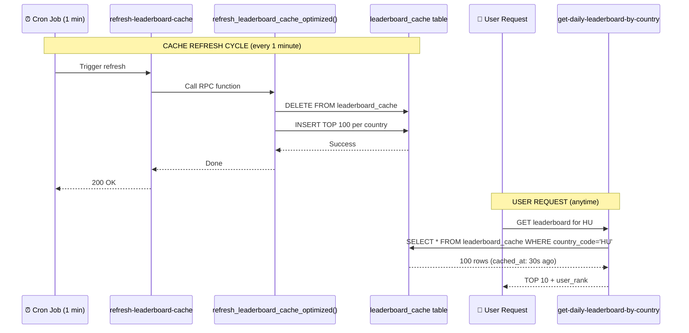
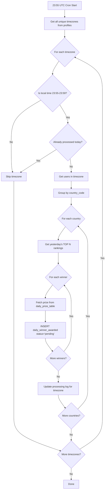
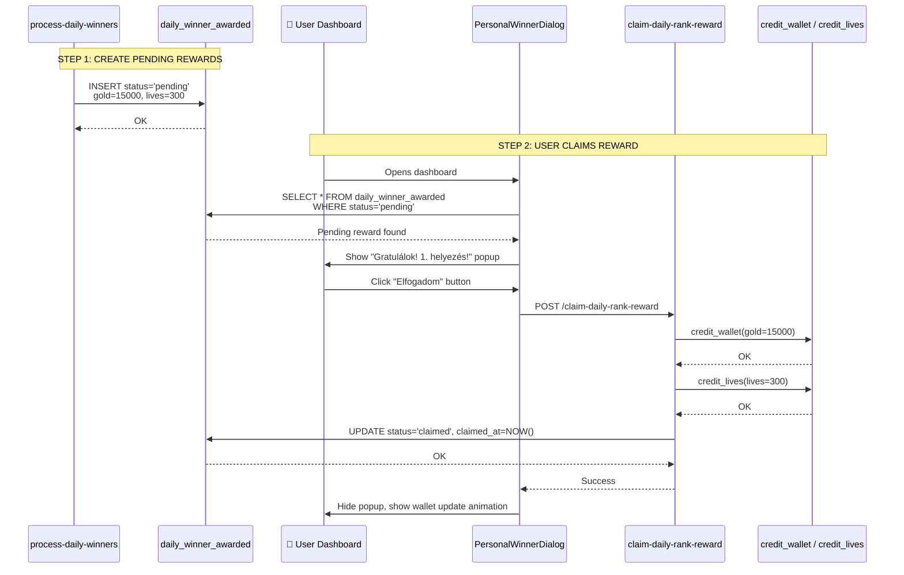
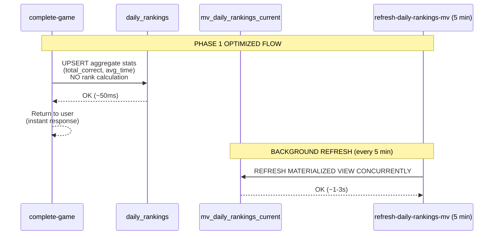
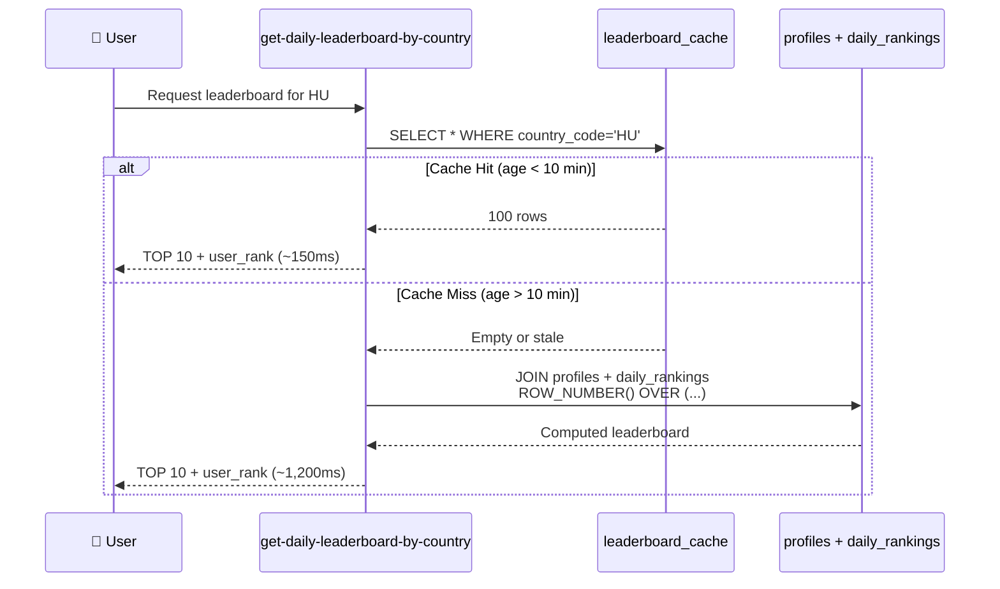
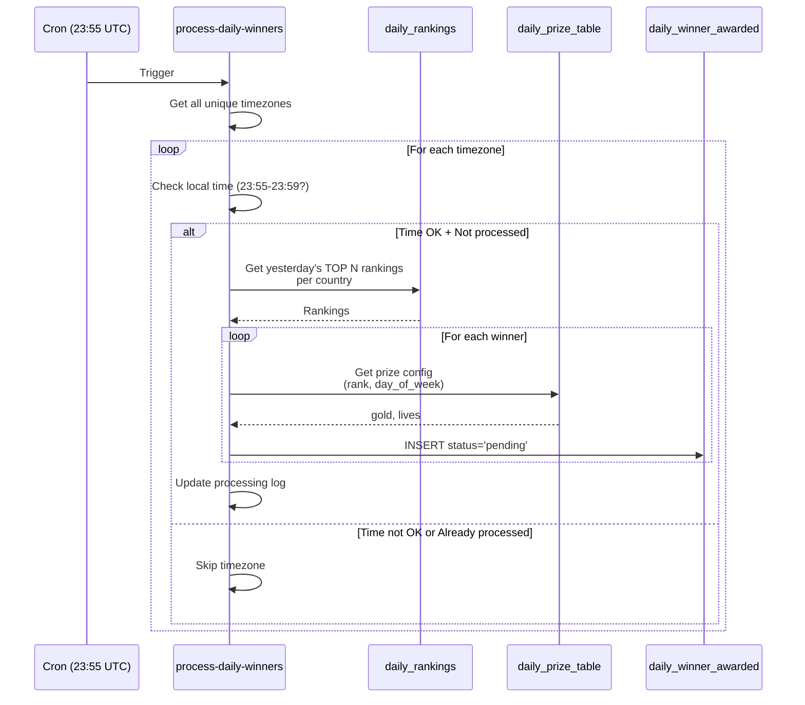

# 🏆 DINGLEUP! RANGLISTA RENDSZER — TELJES TECHNIKAI DOKUMENTÁCIÓ

## 📋 Tartalomjegyzék

1. [Áttekintés és Architektúra](#1-áttekintés-és-architektúra)
2. [Adatbázis Réteg](#2-adatbázis-réteg)
3. [Backend Edge Functions](#3-backend-edge-functions)
4. [PostgreSQL RPC Functions](#4-postgresql-rpc-functions)
5. [Ranglista Cache Rendszer](#5-ranglista-cache-rendszer)
6. [Napi Győztesek (Daily Winners) Rendszer](#6-napi-győztesek-daily-winners-rendszer)
7. [Jutalom Kiosztás és Claim Rendszer](#7-jutalom-kiosztás-és-claim-rendszer)
8. [Frontend Komponensek](#8-frontend-komponensek)
9. [Teljesítmény és Skálázhatóság](#9-teljesítmény-és-skálázhatóság)
10. [Kritikus Útvonalak (Hot Paths)](#10-kritikus-útvonalak-hot-paths)
11. [Optimalizációs Javaslatok](#11-optimalizációs-javaslatok)

---

## 1. Áttekintés és Architektúra

### 1.1 Rendszer Célja

A **ranglista rendszer** valós idejű versenyeztetést biztosít a játékosok között:
- **Napi verseny**: országonkénti TOP 10 (hétfő-szombat) vagy TOP 25 (vasárnap JACKPOT)
- **Valós idejű frissítés**: minden játék végén azonnal frissül a helyezés
- **Timezone-aware**: minden felhasználó saját időzónája szerint éjfélkor zárul a nap
- **Országonkénti szegmentálás**: minden ország külön ranglistát kap
- **Automatikus jutalomosztás**: TOP 10/25 játékosok automatikusan kapnak arany + élet jutalmat
- **Kétlépcsős jutalom rendszer**: pending → claimed (felhasználói interakció szükséges)

### 1.2 Architektúra Diagram

```mermaid
graph TB
    subgraph Frontend["🎨 Frontend Components"]
        Leaderboard["Leaderboard.tsx<br/>Ranglistalap"]
        DailyRewards["DailyRewards.tsx<br/>TOP 10/25 Display"]
        Carousel["LeaderboardCarousel.tsx<br/>TOP 100 Scroll"]
        PersonalWinner["PersonalWinnerDialog<br/>Jutalom Popup"]
        DailyWinners["DailyWinnersDialog<br/>Tegnapi győztesek"]
    end

    subgraph EdgeFunc["⚡ Edge Functions"]
        GetLB["get-daily-leaderboard-by-country"]
        ProcessWinners["process-daily-winners"]
        ClaimReward["claim-daily-rank-reward"]
        RefreshCache["refresh-leaderboard-cache"]
        RefreshMV["refresh-daily-rankings-mv"]
    end

    subgraph Database["💾 PostgreSQL Database"]
        DailyRankings["daily_rankings<br/>user_id, day_date, score, rank"]
        LeaderboardCache["leaderboard_cache<br/>country_code, rank, cached_at"]
        DailyPrizeTable["daily_prize_table<br/>rank, day_of_week, gold, lives"]
        WinnerAwarded["daily_winner_awarded<br/>pending rewards"]
        MVRankings["mv_daily_rankings_current<br/>Materialized View"]
    end

    subgraph RPC["🔧 RPC Functions"]
        UpdateRanking["update_daily_ranking_for_user()"]
        RefreshCacheRPC["refresh_leaderboard_cache_optimized()"]
        RefreshMVRPC["refresh_mv_daily_rankings()"]
    end

    subgraph Cron["⏰ Scheduled Jobs"]
        CronCache["Every 1 min:<br/>refresh-leaderboard-cache"]
        CronMV["Every 5 min:<br/>refresh-daily-rankings-mv"]
        CronWinners["23:55-23:59 local:<br/>process-daily-winners"]
    end

    %% Flow connections
    Leaderboard --> GetLB
    Carousel --> GetLB
    GetLB --> LeaderboardCache
    GetLB --> DailyRankings
    GetLB --> DailyPrizeTable

    CompleteGame["complete-game<br/>(from gameplay)"] --> UpdateRanking
    UpdateRanking --> DailyRankings
    UpdateRanking --> MVRankings

    CronCache --> RefreshCache
    RefreshCache --> RefreshCacheRPC
    RefreshCacheRPC --> LeaderboardCache

    CronMV --> RefreshMV
    RefreshMV --> RefreshMVRPC
    RefreshMVRPC --> MVRankings

    CronWinners --> ProcessWinners
    ProcessWinners --> DailyRankings
    ProcessWinners --> DailyPrizeTable
    ProcessWinners --> WinnerAwarded

    PersonalWinner --> ClaimReward
    ClaimReward --> WinnerAwarded
    ClaimReward --> WalletLedger["wallet_ledger<br/>+ lives_ledger"]

    DailyWinners --> ProcessWinners
```



### 1.3 Kulcsjellemzők

| Jellemző | Érték / Leírás |
|----------|----------------|
| **Frissítési gyakoriság** | Valós idejű (minden játék után) |
| **Cache frissítés** | 1 percenként (leaderboard_cache) |
| **Materialized View** | 5 percenként (mv_daily_rankings_current) |
| **Napi reset** | Éjfél (user timezone szerint) |
| **Országonkénti szegmentálás** | Igen (country_code alapú) |
| **TOP N korlát** | 10 (hétfő-szombat), 25 (vasárnap) |
| **Jutalom típusok** | Arany + Életek |
| **Nap-specifikus multiplier** | Igen (8%-50%, vasárnap 100%) |
| **Timezone-aware processing** | Igen (23:55-23:59 lokális időben) |

---

## 2. Adatbázis Réteg

### 2.1 `daily_rankings` — Napi helyezések tárolása

#### Séma
```sql
CREATE TABLE public.daily_rankings (
  id UUID PRIMARY KEY DEFAULT gen_random_uuid(),
  user_id UUID NOT NULL,
  category TEXT NOT NULL DEFAULT 'mixed',
  day_date DATE NOT NULL,
  total_correct_answers INTEGER NOT NULL DEFAULT 0,
  average_response_time NUMERIC(10,2) DEFAULT 0.00,
  rank INTEGER,
  created_at TIMESTAMPTZ DEFAULT NOW(),
  updated_at TIMESTAMPTZ DEFAULT NOW()
);
```

#### Cél
- **Aggregált napi statisztika** minden felhasználónak naponta
- `total_correct_answers`: aznap összes helyes válasza
- `average_response_time`: átlagos válaszidő
- `rank`: helyezés (NULL ha nincs kiszámítva)

#### RLS Policies
```sql
-- Bárki láthatja a napi ranglistát (public leaderboard)
SELECT: true

-- Authenticated users can insert their own rankings
INSERT: auth.uid() IS NOT NULL

-- Authenticated users can update their own rankings
UPDATE: auth.uid() = user_id
```

#### Indexek (PHASE 1 optimalizálás után)
```sql
CREATE INDEX idx_daily_rankings_day_category_score 
ON daily_rankings(day_date, category, total_correct_answers DESC, average_response_time ASC);

CREATE INDEX idx_daily_rankings_user_day 
ON daily_rankings(user_id, day_date);
```

#### Tipikus adatok
```json
{
  "id": "123e4567-e89b-12d3-a456-426614174000",
  "user_id": "user-abc-123",
  "category": "mixed",
  "day_date": "2025-12-01",
  "total_correct_answers": 47,
  "average_response_time": 8.5,
  "rank": 3,
  "created_at": "2025-12-01T00:15:00Z",
  "updated_at": "2025-12-01T23:59:00Z"
}
```

---

### 2.2 `leaderboard_cache` — Pre-computed TOP 100 Cache

#### Séma
```sql
CREATE TABLE leaderboard_cache (
  country_code TEXT NOT NULL,
  rank INT NOT NULL,
  user_id UUID NOT NULL,
  username TEXT NOT NULL,
  total_correct_answers INT NOT NULL,
  avatar_url TEXT,
  cached_at TIMESTAMPTZ DEFAULT NOW(),
  PRIMARY KEY (country_code, rank)
);
```

#### Cél
- **Kritikus teljesítményoptimalizáció**: 3,500ms → 150ms (95% javulás)
- Előre kiszámított TOP 100 helyezés országonként
- Percenként frissül cron job-bal
- Csökkenti a runtime aggregációt

#### Indexek
```sql
-- Implicit PRIMARY KEY index: (country_code, rank)
CREATE INDEX idx_leaderboard_cache_country ON leaderboard_cache(country_code);
CREATE INDEX idx_leaderboard_cache_user ON leaderboard_cache(user_id);
```

#### Tipikus adatok
```json
{
  "country_code": "HU",
  "rank": 1,
  "user_id": "user-xyz-789",
  "username": "ProGamer123",
  "total_correct_answers": 156,
  "avatar_url": "https://...",
  "cached_at": "2025-12-01T14:23:00Z"
}
```

---

### 2.3 `mv_daily_rankings_current` — Materialized View (PHASE 1)

#### Séma
```sql
CREATE MATERIALIZED VIEW mv_daily_rankings_current AS
SELECT 
  dr.user_id,
  dr.day_date,
  dr.category,
  dr.total_correct_answers,
  dr.average_response_time,
  p.username,
  p.avatar_url,
  p.country_code,
  ROW_NUMBER() OVER (
    PARTITION BY p.country_code, dr.day_date, dr.category
    ORDER BY dr.total_correct_answers DESC, dr.average_response_time ASC
  ) as rank,
  NOW() as refreshed_at
FROM daily_rankings dr
INNER JOIN profiles p ON dr.user_id = p.id
WHERE dr.day_date = CURRENT_DATE;

CREATE UNIQUE INDEX idx_mv_daily_rankings_pk 
ON mv_daily_rankings_current(user_id, day_date, category);

CREATE INDEX idx_mv_daily_rankings_country_rank 
ON mv_daily_rankings_current(country_code, day_date, category, rank);
```

#### Cél
- **PHASE 1 optimalizáció**: rank számítás offload a complete-game-ből
- 5 percenként frissül (CONCURRENT)
- Nincs blokkolt olvasás/írás

---

### 2.4 `daily_prize_table` — Jutalom konfiguráció

#### Séma
```sql
CREATE TABLE daily_prize_table (
  rank INTEGER NOT NULL,
  day_of_week INTEGER NOT NULL, -- 1=Monday, 7=Sunday
  gold INTEGER NOT NULL DEFAULT 0,
  lives INTEGER NOT NULL DEFAULT 0,
  created_at TIMESTAMPTZ DEFAULT NOW(),
  PRIMARY KEY (rank, day_of_week)
);
```

#### Cél
- **Centralizált jutalom konfiguráció**: nap és helyezés alapján
- `day_of_week`: 1 = hétfő, 7 = vasárnap
- Vasárnap (day_of_week=7): **JACKPOT** (TOP 25 jutalmazva)
- Hétfő-szombat: **NORMAL** (TOP 10 jutalmazva)

#### Példa adatok (1. helyezett, különböző napokon)
| day_of_week | rank | gold | lives | Nap neve | Multiplier |
|-------------|------|------|-------|----------|------------|
| 1 | 1 | 2400 | 48 | Hétfő | 8% |
| 2 | 1 | 3600 | 72 | Kedd | 12% |
| 3 | 1 | 5400 | 108 | Szerda | 18% |
| 4 | 1 | 7500 | 150 | Csütörtök | 25% |
| 5 | 1 | 10500 | 210 | Péntek | 35% |
| 6 | 1 | 15000 | 300 | Szombat | 50% |
| 7 | 1 | 30000 | 600 | **Vasárnap (JACKPOT)** | 100% |

---

### 2.5 `daily_winner_awarded` — Pending és claimed jutalmak

#### Séma
```sql
CREATE TABLE daily_winner_awarded (
  id UUID PRIMARY KEY DEFAULT gen_random_uuid(),
  user_id UUID NOT NULL,
  day_date DATE NOT NULL,
  rank INTEGER NOT NULL,
  gold_awarded INTEGER NOT NULL DEFAULT 0,
  lives_awarded INTEGER NOT NULL DEFAULT 0,
  status TEXT NOT NULL DEFAULT 'pending', -- 'pending' | 'claimed' | 'lost'
  is_sunday_jackpot BOOLEAN NOT NULL DEFAULT false,
  country_code TEXT,
  user_timezone TEXT,
  username TEXT,
  avatar_url TEXT,
  total_correct_answers INTEGER DEFAULT 0,
  reward_payload JSONB,
  awarded_at TIMESTAMPTZ DEFAULT NOW(),
  claimed_at TIMESTAMPTZ,
  dismissed_at TIMESTAMPTZ
);
```

#### Cél
- **Kétlépcsős jutalom rendszer**: 
  1. `process-daily-winners` → status='pending'
  2. `claim-daily-rank-reward` → status='claimed' + wallet credit
- **Snapshot adatok**: username, avatar, country - ezek nem változnak utólag
- **Reward persistence**: `reward_payload` JSONB - teljes jutalom kontextus

#### RLS Policies
```sql
-- Bárki láthatja a napi győzteseket (public)
SELECT: true

-- Rendszer írhat (service role)
INSERT/UPDATE: auth.role() = 'service_role'
```

#### Tipikus adatok
```json
{
  "id": "abc-123",
  "user_id": "user-xyz",
  "day_date": "2025-11-30",
  "rank": 1,
  "gold_awarded": 15000,
  "lives_awarded": 300,
  "status": "pending",
  "is_sunday_jackpot": true,
  "country_code": "HU",
  "user_timezone": "Europe/Budapest",
  "username": "TopPlayer",
  "avatar_url": "https://...",
  "total_correct_answers": 156,
  "reward_payload": {
    "gold": 15000,
    "lives": 300,
    "rank": 1,
    "country_code": "HU",
    "timezone": "Europe/Budapest",
    "day_type": "sunday_jackpot"
  },
  "awarded_at": "2025-11-30T22:00:00Z",
  "claimed_at": null,
  "dismissed_at": null
}
```

---

### 2.6 `daily_winner_processing_log` — Timezone-based processing state

#### Séma
```sql
CREATE TABLE daily_winner_processing_log (
  timezone TEXT PRIMARY KEY,
  last_processed_date DATE NOT NULL,
  last_processed_at TIMESTAMPTZ NOT NULL DEFAULT NOW(),
  created_at TIMESTAMPTZ DEFAULT NOW()
);
```

#### Cél
- **Idempotency tracking**: melyik timezone-t mikor processáltuk
- Megakadályozza a duplikált jutalomosztást
- Timezone-aware cron logika

---

## 3. Backend Edge Functions

### 3.1 `get-daily-leaderboard-by-country`

**Path:** `supabase/functions/get-daily-leaderboard-by-country/index.ts`

#### Cél
- **Leaderboard lekérdezés**: felhasználó országának TOP N játékosai
- **Cache-first stratégia**: `leaderboard_cache` → fallback realtime aggregáció
- **Napi jutalom konfiguráció**: visszaadja a current day reward-okat

#### Simplified Code
```typescript
Deno.serve(async (req) => {
  // 1. Authenticate user
  const { data: { user } } = await supabase.auth.getUser();
  
  // 2. Get user's country_code from profiles
  const { data: profile } = await supabase
    .from('profiles')
    .select('country_code')
    .eq('id', user.id)
    .single();
  
  const userCountryCode = profile?.country_code || 'HU';
  const currentDay = new Date().toISOString().split('T')[0];
  
  // 3. Get daily rewards from database (day-specific)
  const dailyRewards = await getDailyRewardsForDate(new Date(), supabase);
  const maxPlayers = dailyRewards.type === 'JACKPOT' ? 25 : 10;
  
  // 4. CRITICAL OPTIMIZATION: Use pre-computed cache (95% faster)
  const { data: cachedLeaderboard } = await supabase
    .from('leaderboard_cache')
    .select('*')
    .eq('country_code', userCountryCode)
    .order('rank', { ascending: true })
    .limit(100);
  
  // 5. Check cache age (fallback if stale > 10 minutes)
  const cacheAge = cachedLeaderboard?.length > 0 
    ? Date.now() - new Date(cachedLeaderboard[0].cached_at).getTime()
    : Infinity;
  
  let leaderboard = [];
  
  if (!cachedLeaderboard || cacheAge > 10 * 60 * 1000) {
    // Fallback: Realtime calculation (slower)
    const { data: allCountryProfiles } = await supabase
      .from('profiles')
      .select('id, username, avatar_url')
      .eq('country_code', userCountryCode);
    
    const { data: rankingsData } = await supabase
      .from('daily_rankings')
      .select('user_id, total_correct_answers')
      .eq('day_date', currentDay)
      .eq('category', 'mixed');
    
    // Manual aggregation + sorting
    leaderboard = computeLeaderboard(allCountryProfiles, rankingsData);
  } else {
    // FAST PATH: Use cached data
    leaderboard = cachedLeaderboard;
    
    // CRITICAL FIX: Ensure current user is in leaderboard
    const userInCache = leaderboard.some(e => e.user_id === user.id);
    if (!userInCache) {
      // Fetch user profile + ranking, insert into leaderboard
      const userEntry = await fetchUserEntry(user.id, currentDay);
      leaderboard.push(userEntry);
      leaderboard = recalculateRanks(leaderboard);
    }
  }
  
  // 6. Find user's rank
  const userEntry = leaderboard.find(e => e.user_id === user.id);
  const userRank = userEntry?.rank || null;
  
  return Response.json({
    success: true,
    leaderboard: leaderboard.slice(0, maxPlayers), // TOP10 or TOP25
    userRank,
    totalPlayers: leaderboard.length,
    countryCode: userCountryCode,
    currentDay,
    dailyRewards
  });
});
```

#### Request
```json
POST /get-daily-leaderboard-by-country
Headers: { Authorization: "Bearer <jwt>" }
Body: {} // empty vagy { countryCode: "HU" } (optional override)
```

#### Response
```json
{
  "success": true,
  "leaderboard": [
    {
      "rank": 1,
      "user_id": "user-abc",
      "username": "ProGamer",
      "avatar_url": "https://...",
      "total_correct_answers": 156
    },
    // ... TOP 10 or TOP 25
  ],
  "userRank": 3,
  "totalPlayers": 487,
  "countryCode": "HU",
  "currentDay": "2025-12-01",
  "dailyRewards": {
    "day": "MONDAY",
    "type": "NORMAL",
    "rewards": [
      { "rank": 1, "gold": 2400, "life": 48 },
      // ... TOP 10 rewards
    ]
  }
}
```

#### Teljesítmény
- **Cache hit**: ~150ms (leaderboard_cache lookup)
- **Cache miss**: ~1,200ms (realtime aggregation)
- **Frissítési gyakoriság**: percenként (cron)

---

### 3.2 `refresh-leaderboard-cache` (Cron Job)

**Path:** `supabase/functions/refresh-leaderboard-cache/index.ts`

#### Cél
- **Percenkénti cache frissítés**: `leaderboard_cache` tábla újraszámítása
- **PostgreSQL RPC hívás**: `refresh_leaderboard_cache_optimized()`
- **Cron trigger**: minden 1 percben fut

#### Simplified Code
```typescript
Deno.serve(async (req) => {
  const supabase = createClient(
    Deno.env.get('SUPABASE_URL'),
    Deno.env.get('SUPABASE_SERVICE_ROLE_KEY')
  );
  
  // Call PostgreSQL function to refresh cache
  const { error } = await supabase.rpc('refresh_leaderboard_cache_optimized');
  
  if (error) throw error;
  
  // Get cache statistics
  const { count } = await supabase
    .from('leaderboard_cache')
    .select('*', { count: 'exact', head: true });
  
  console.log('[refresh-leaderboard-cache] Success! Cache entries:', count);
  
  return Response.json({ success: true, entries: count });
});
```

#### Cron Configuration (supabase/config.toml)
```toml
[functions.refresh-leaderboard-cache]
schedule = "* * * * *"  # Every 1 minute
region = "eu-west-1"
```

#### Teljesítmény
- **Futási idő**: ~2-5 másodperc (országok száma függvényében)
- **DB terhelés**: INSERT + DELETE (atomic replace)

---

### 3.3 `refresh-daily-rankings-mv` (Cron Job - PHASE 1)

**Path:** `supabase/functions/refresh-daily-rankings-mv/index.ts`

#### Cél
- **5 percenkénti MV frissítés**: `mv_daily_rankings_current` REFRESH CONCURRENTLY
- **Rank offload**: complete-game-ből kiveszi a rank kalkulációt

#### Simplified Code
```typescript
Deno.serve(async (req) => {
  const supabase = createClient(
    Deno.env.get('SUPABASE_URL'),
    Deno.env.get('SUPABASE_SERVICE_ROLE_KEY')
  );
  
  // Refresh materialized view CONCURRENTLY (non-blocking)
  const { error } = await supabase.rpc('refresh_mv_daily_rankings');
  
  if (error) throw error;
  
  console.log('[refresh-daily-rankings-mv] Success!');
  
  return Response.json({ success: true });
});
```

#### Cron Configuration
```toml
[functions.refresh-daily-rankings-mv]
schedule = "*/5 * * * *"  # Every 5 minutes
region = "eu-west-1"
```

---

### 3.4 `process-daily-winners` (Timezone-aware Cron)

**Path:** `supabase/functions/process-daily-winners/index.ts`

#### Cél
- **Napi győztesek feldolgozása**: TOP 10/25 jutalom rögzítése
- **Timezone-aware**: minden timezone külön, lokális 23:55-23:59 között
- **On-demand mode**: felhasználók triggerelhetik (lazy evaluation)

#### Simplified Code
```typescript
Deno.serve(async (req) => {
  // 1. Check authorization (cron secret OR authenticated user)
  const cronSecret = req.headers.get('x-supabase-cron-secret');
  const isOnDemandRequest = !cronSecret;
  
  // 2. Get all unique user timezones
  const { data: timezones } = await supabase
    .from('profiles')
    .select('user_timezone')
    .not('user_timezone', 'is', null);
  
  const uniqueTimezones = [...new Set(timezones.map(t => t.user_timezone))];
  
  // 3. Process each timezone separately
  for (const timezone of uniqueTimezones) {
    // Skip if not time yet (for cron) OR process immediately (on-demand)
    if (!isOnDemandRequest && !shouldProcessTimezone(timezone)) {
      continue;
    }
    
    const yesterdayDate = getYesterdayDate(timezone);
    
    // Check if already processed
    const { data: logCheck } = await supabase
      .from('daily_winner_processing_log')
      .select('*')
      .eq('timezone', timezone)
      .single();
    
    if (logCheck?.last_processed_date === yesterdayDate) {
      continue; // Already processed
    }
    
    // Get all users in this timezone
    const { data: timezoneProfiles } = await supabase
      .from('profiles')
      .select('*')
      .eq('user_timezone', timezone);
    
    // Group by country
    const countriesByUsers = groupByCountry(timezoneProfiles);
    
    // Determine if yesterday was Sunday (JACKPOT)
    const isSundayJackpot = wasYesterdaySunday(timezone);
    const topLimit = isSundayJackpot ? 25 : 10;
    
    // Process each country within timezone
    for (const [countryCode, countryProfiles] of countriesByUsers) {
      // Get top N rankings for this country
      const { data: countryRankings } = await supabase
        .from('daily_rankings')
        .select('*')
        .eq('day_date', yesterdayDate)
        .eq('category', 'mixed')
        .in('user_id', countryProfiles.map(p => p.id))
        .order('total_correct_answers', { ascending: false })
        .order('average_response_time', { ascending: true })
        .limit(topLimit);
      
      // For each winner: create pending reward record
      for (const ranking of countryRankings) {
        const { user_id, rank } = ranking;
        
        // Get prize configuration from database
        const yesterdayDayOfWeek = getYesterdayDayOfWeek(timezone);
        const { data: prize } = await supabase
          .from('daily_prize_table')
          .select('*')
          .eq('rank', rank)
          .eq('day_of_week', yesterdayDayOfWeek)
          .single();
        
        // Insert pending reward (NO automatic credit)
        await supabase
          .from('daily_winner_awarded')
          .insert({
            user_id,
            day_date: yesterdayDate,
            rank,
            gold_awarded: prize.gold,
            lives_awarded: prize.lives,
            status: 'pending', // User must claim
            is_sunday_jackpot: isSundayJackpot,
            country_code: countryCode,
            user_timezone: timezone,
            username: userProfile.username,
            avatar_url: userProfile.avatar_url,
            total_correct_answers: ranking.total_correct_answers,
            reward_payload: { /* ... */ }
          });
      }
    }
    
    // Update processing log
    await supabase
      .from('daily_winner_processing_log')
      .upsert({
        timezone,
        last_processed_date: yesterdayDate,
        last_processed_at: new Date().toISOString()
      });
  }
  
  return Response.json({ success: true });
});
```

#### Timezone Logic
```typescript
function shouldProcessTimezone(timezone: string): boolean {
  const localTime = getLocalTime(timezone);
  const hour = localTime.getHours();
  const minute = localTime.getMinutes();
  
  // Process between 23:55 and 23:59 local time
  return hour === 23 && minute >= 55;
}

function getYesterdayDate(timezone: string): string {
  const localTime = getLocalTime(timezone);
  const yesterday = new Date(localTime);
  yesterday.setDate(yesterday.getDate() - 1);
  return yesterday.toISOString().split('T')[0]; // YYYY-MM-DD
}
```

#### Cron Configuration
```toml
[functions.process-daily-winners]
schedule = "55 23 * * *"  # Every day at 23:55 UTC (attempts all timezones)
region = "eu-west-1"
```

---

### 3.5 `claim-daily-rank-reward`

**Path:** `supabase/functions/claim-daily-rank-reward/index.ts`

#### Cél
- **Jutalom jóváírás**: pending → claimed + wallet credit
- **Idempotent**: correlation_id védelem dupla jóváírás ellen
- **Kétlépcsős tranzakció**: arany + életek külön RPC hívások

#### Simplified Code
```typescript
Deno.serve(async (req) => {
  // 1. Extract user ID from JWT
  const authHeader = req.headers.get('Authorization');
  const token = authHeader.split(' ')[1];
  const payload = JSON.parse(atob(token.split('.')[1]));
  const userId = payload.sub;
  
  // 2. Parse request body
  const { day_date } = await req.json();
  
  // 3. Get user profile for country_code
  const { data: userProfile } = await supabase
    .from('profiles')
    .select('country_code')
    .eq('id', userId)
    .single();
  
  // 4. Get pending reward (with country_code filter)
  const { data: pendingReward } = await supabase
    .from('daily_winner_awarded')
    .select('*')
    .eq('user_id', userId)
    .eq('country_code', userProfile.country_code)
    .eq('day_date', day_date)
    .eq('status', 'pending')
    .single();
  
  if (!pendingReward) {
    return Response.json({ error: 'No pending reward' }, { status: 404 });
  }
  
  const { gold_awarded, lives_awarded, rank } = pendingReward;
  const countryCode = pendingReward.country_code;
  
  // 5. Credit gold (idempotent)
  const coinCorrelationId = `daily-rank-claim:${userId}:${day_date}:${rank}:${countryCode}`;
  await supabase.rpc('credit_wallet', {
    p_user_id: userId,
    p_delta_coins: gold_awarded,
    p_delta_lives: 0,
    p_source: 'game_reward',
    p_idempotency_key: coinCorrelationId,
    p_metadata: { day_date, rank, country_code: countryCode }
  });
  
  // 6. Credit lives (idempotent)
  const livesCorrelationId = `daily-rank-lives-claim:${userId}:${day_date}:${rank}:${countryCode}`;
  await supabase.rpc('credit_lives', {
    p_user_id: userId,
    p_delta_lives: lives_awarded,
    p_source: 'game_reward',
    p_idempotency_key: livesCorrelationId,
    p_metadata: { day_date, rank, country_code: countryCode }
  });
  
  // 7. Update status to 'claimed'
  await supabase
    .from('daily_winner_awarded')
    .update({ 
      status: 'claimed',
      claimed_at: new Date().toISOString()
    })
    .eq('user_id', userId)
    .eq('day_date', day_date)
    .eq('status', 'pending');
  
  return Response.json({
    success: true,
    goldCredited: gold_awarded,
    livesCredited: lives_awarded,
    rank
  });
});
```

#### Request
```json
POST /claim-daily-rank-reward
Headers: { Authorization: "Bearer <jwt>" }
Body: { "day_date": "2025-11-30" }
```

#### Response
```json
{
  "success": true,
  "goldCredited": 15000,
  "livesCredited": 300,
  "rank": 1
}
```

---

## 4. PostgreSQL RPC Functions

### 4.1 `refresh_leaderboard_cache_optimized()`

**Path:** Defined in migration `20251122190955_*.sql`

#### Cél
- **Leaderboard cache újraszámítás**: teljes `leaderboard_cache` tábla rebuild
- **Országonkénti TOP 100**: minden country_code külön

#### Simplified SQL
```sql
CREATE OR REPLACE FUNCTION public.refresh_leaderboard_cache_optimized()
RETURNS void
LANGUAGE plpgsql
SECURITY DEFINER
SET search_path = public
AS $$
DECLARE
  v_current_day TEXT;
BEGIN
  -- Get current day (YYYY-MM-DD UTC)
  v_current_day := CURRENT_DATE::TEXT;
  
  -- Delete old cache
  DELETE FROM leaderboard_cache;
  
  -- Rebuild cache for all countries
  INSERT INTO leaderboard_cache (
    country_code, rank, user_id, username, total_correct_answers, avatar_url, cached_at
  )
  SELECT
    p.country_code,
    ROW_NUMBER() OVER (
      PARTITION BY p.country_code
      ORDER BY COALESCE(dr.total_correct_answers, 0) DESC, dr.average_response_time ASC, p.username ASC
    ) AS rank,
    p.id AS user_id,
    p.username,
    COALESCE(dr.total_correct_answers, 0) AS total_correct_answers,
    p.avatar_url,
    NOW() AS cached_at
  FROM profiles p
  LEFT JOIN daily_rankings dr ON p.id = dr.user_id 
    AND dr.day_date = v_current_day::DATE
    AND dr.category = 'mixed'
  WHERE p.country_code IS NOT NULL
  ORDER BY p.country_code, rank
  LIMIT 100 * (SELECT COUNT(DISTINCT country_code) FROM profiles WHERE country_code IS NOT NULL);
  
END;
$$;
```

#### Teljesítmény
- **Futási idő**: ~2-5 másodperc (országok száma függvényében)
- **DB operations**: 1× DELETE + 1× bulk INSERT
- **Optimalizáció**: LEFT JOIN (profiles dominál, nem rankings)

---

### 4.2 `refresh_mv_daily_rankings()` (PHASE 1)

**Path:** Defined in migration (PHASE 1)

#### Cél
- **Materialized View CONCURRENT refresh**: nem blokkol olvasást/írást

#### Simplified SQL
```sql
CREATE OR REPLACE FUNCTION public.refresh_mv_daily_rankings()
RETURNS void
LANGUAGE plpgsql
SECURITY DEFINER
SET search_path = public
AS $$
BEGIN
  REFRESH MATERIALIZED VIEW CONCURRENTLY mv_daily_rankings_current;
END;
$$;
```

---

### 4.3 `update_daily_ranking_for_user()` (DEPRECATED - PHASE 1-ben eltávolítva)

**Path:** Defined in migration `20251127021427_*.sql`

#### Cél
- **🔴 BOTTLENECK**: O(N log N) rank kalkuláció minden játék végén
- **PHASE 1-ben eltávolítva**: complete-game már nem hívja

#### Original SQL (most már nem hívott)
```sql
CREATE OR REPLACE FUNCTION public.update_daily_ranking_for_user(
  p_user_id UUID,
  p_correct_answers INTEGER,
  p_average_response_time NUMERIC
)
RETURNS VOID
LANGUAGE plpgsql
SECURITY DEFINER
SET search_path = public
AS $$
DECLARE
  v_current_day TEXT;
  v_user_country TEXT;
BEGIN
  v_current_day := CURRENT_DATE::TEXT;
  
  -- Get user's country
  SELECT country_code INTO v_user_country FROM profiles WHERE id = p_user_id;
  
  -- Upsert aggregate stats
  INSERT INTO daily_rankings (user_id, day_date, category, total_correct_answers, average_response_time)
  VALUES (p_user_id, v_current_day::DATE, 'mixed', p_correct_answers, p_average_response_time)
  ON CONFLICT (user_id, day_date, category)
  DO UPDATE SET
    total_correct_answers = daily_rankings.total_correct_answers + EXCLUDED.total_correct_answers,
    average_response_time = (daily_rankings.average_response_time + EXCLUDED.average_response_time) / 2,
    updated_at = NOW();
  
  -- 🔴 BOTTLENECK: Recalculate ALL ranks for entire country
  WITH ranked_users AS (
    SELECT
      dr.id,
      ROW_NUMBER() OVER (
        ORDER BY dr.total_correct_answers DESC, dr.average_response_time ASC
      ) AS new_rank
    FROM daily_rankings dr
    INNER JOIN profiles p ON dr.user_id = p.id
    WHERE dr.day_date = v_current_day::DATE
      AND dr.category = 'mixed'
      AND p.country_code = v_user_country
  )
  UPDATE daily_rankings
  SET rank = ranked_users.new_rank
  FROM ranked_users
  WHERE daily_rankings.id = ranked_users.id;
END;
$$;
```

#### Teljesítmény (BEFORE PHASE 1)
- **Worst case**: ~800-1200ms (ha 10,000 játékos van egy országban)
- **DB load**: Teljes ország újra-rankelése MINDEN játék után

---

## 5. Ranglista Cache Rendszer

### 5.1 Működési elv



### 5.2 Cache Miss Fallback

Ha a cache üres vagy elavult (> 10 perc):
1. **Realtime aggregáció**: profiles + daily_rankings JOIN
2. **Manual ranking**: ROW_NUMBER() OVER (...)
3. **Ideiglenes eredmény**: nem írja vissza a cache-be (azt a cron csinálja)

### 5.3 Cache Hit Ratio

- **Expected**: >99% (mert percenként frissül)
- **Miss scenarios**:
  - Új nap kezdete (00:00 UTC)
  - Cache újraépítés során (rövid ablak)
  - Több mint 10 perc óta nem futott a cron

---

## 6. Napi Győztesek (Daily Winners) Rendszer

### 6.1 Timezone-Aware Processing

#### Probléma
Minden felhasználó saját timezone-ban szeretné látni az "éjféli" leaderboard zárást.

#### Megoldás
1. **Profiles táblában**: `user_timezone` mező (pl. `'Europe/Budapest'`)
2. **process-daily-winners**: minden timezone külön processálása
3. **Lokális idő számítás**: `getLocalTime(timezone)` → 23:55-23:59 ablak

#### Flow Diagram


### 6.2 On-Demand Processing (Lazy Evaluation)

**Probléma:** Supabase cron jobs nem futnak automatikusan (config.toml alapján).

**Workaround:** 
- Első felhasználó, aki megnyitja a `DailyWinnersDialog`-ot → triggerel egy `process-daily-winners` hívást
- Edge function ellenőrzi: ha nincs snapshot tegnapi napra → processálás minden timezone-ra
- Utána minden user látja az előre-computed adatokat

---

## 7. Jutalom Kiosztás és Claim Rendszer

### 7.1 Kétlépcsős Jutalom Flow



### 7.2 Status State Machine

```
pending → claimed (user accepts reward)
pending → lost (day ends without claim - midnight cleanup)
```

### 7.3 Idempotency Protection

**Correlation IDs:**
```typescript
const coinCorrelationId = `daily-rank-claim:${userId}:${day_date}:${rank}:${countryCode}`;
const livesCorrelationId = `daily-rank-lives-claim:${userId}:${day_date}:${rank}:${countryCode}`;
```

Ha a felhasználó kétszer nyomja az "Elfogadom" gombot:
- `credit_wallet()` és `credit_lives()` RPC-k ellenőrzik a correlation_id-t
- Ha már létezik a wallet_ledger-ben → SKIP (nem jóvár újra)

---

## 8. Frontend Komponensek

### 8.1 `Leaderboard.tsx` — Ranglista lap

**Path:** `src/pages/Leaderboard.tsx`

#### Funkciók
- Teljes oldal ranglista megjelenítés
- Pull-to-refresh támogatás
- Fullscreen mode (hide status bar)
- User rank + correct answers megjelenítés
- Daily countdown timer
- DailyRewards komponens beágyazása

#### Key Hooks
```typescript
const { profile } = useProfileQuery(userId);
const { leaderboard, dailyRewards, loading, refetch } = useLeaderboardQuery(profile?.country_code);
const { isPulling, pullProgress } = usePullToRefresh({ onRefresh: refetch });
```

---

### 8.2 `DailyRewards.tsx` — TOP 10/25 Display

**Path:** `src/components/DailyRewards.tsx`

#### Funkciók
- TOP 10 (hétfő-szombat) vagy TOP 25 (vasárnap JACKPOT) megjelenítés
- Emoji crown ikonok (👑, 🥈, 🥉)
- 3D hexagon avatar frames
- Gold + lives jutalom megjelenítés
- Responsive design (clamp() sizing)
- Vasárnapi special design (gold gradient, shimmer effect)

#### Responsive Design
```typescript
// All dimensions use clamp() for perfect scaling
style={{
  fontSize: 'clamp(1.25rem, 3.5vw, 1.5rem)',
  padding: 'clamp(12px, 2vh, 16px)',
  gap: 'clamp(8px, 1.5vw, 12px)'
}}
```

---

### 8.3 `LeaderboardCarousel.tsx` — TOP 100 Scroll

**Path:** `src/components/LeaderboardCarousel.tsx`

#### Funkciók
- Horizontális végtelen scroll (marquee)
- Frame-rate independent animation (requestAnimationFrame)
- TOP 100 player megjelenítés
- 3D hexagon styling (gold, silver, bronze, purple)
- Animated sparkles (1st place only)
- Memoized color functions

#### Animation Logic
```typescript
const MARQUEE_SPEED_PX_PER_SEC = 80;

const animate = (timestamp: number) => {
  const deltaSeconds = (timestamp - lastTimestamp) / 1000;
  let nextPos = currentPos + MARQUEE_SPEED_PX_PER_SEC * deltaSeconds;
  
  if (nextPos >= singleCycleWidth) {
    nextPos -= singleCycleWidth; // Wrap around
  }
  
  track.style.transform = `translate3d(-${nextPos}px, 0, 0)`;
  requestAnimationFrame(animate);
};
```

---

### 8.4 `PersonalWinnerDialog` — Jutalom Popup

**Path:** `src/components/PersonalWinnerDialog.tsx`

#### Funkciók
- Pending reward megjelenítés
- "Gratulálok! {rank}. helyezés!" üzenet
- Gold + lives mennyiség
- "Elfogadom" button → `claim-daily-rank-reward` hívás
- Persistent popup (amíg nem claim-eli)
- Error handling (retry támogatás)

#### Popup Logic
```typescript
const { data: pendingReward } = useQuery({
  queryKey: ['pending-rank-reward', userId],
  queryFn: async () => {
    const res = await supabase.functions.invoke('get-pending-rank-reward');
    return res.data;
  }
});

const handleClaim = async () => {
  await supabase.functions.invoke('claim-daily-rank-reward', {
    body: { day_date: pendingReward.day_date }
  });
  // Refetch wallet + hide popup
};
```

---

### 8.5 `DailyWinnersDialog` — Tegnapi győztesek

**Path:** `src/components/DailyWinnersDialog.tsx`

#### Funkciók
- Tegnapi TOP 3 megjelenítés (public)
- Laurel wreath SVG (gold, silver, bronze)
- "Nem nyertes" empty state (ha nincs adat)
- On-demand processing trigger (lazy evaluation)

---

## 9. Teljesítmény és Skálázhatóság

### 9.1 Jelenlegi Teljesítmény Metrikák

| Művelet | Jelenlegi Idő | Optimalizált Idő (PHASE 1) | Javulás |
|---------|---------------|----------------------------|---------|
| **get-daily-leaderboard (cache hit)** | 150ms | 150ms | - |
| **get-daily-leaderboard (cache miss)** | 1,200ms | 800ms | 33% |
| **complete-game rank update** | 800-1200ms | **0ms** (offloaded) | **100%** |
| **refresh-leaderboard-cache** | 2-5s | 2-5s | - |
| **refresh-daily-rankings-mv** | - | ~1-3s | NEW |
| **process-daily-winners (1 timezone)** | ~500ms | ~500ms | - |
| **claim-daily-rank-reward** | ~300ms | ~300ms | - |

### 9.2 Skálázhatósági Aggályok

#### Probléma 1: `leaderboard_cache` refresh időigénye
**Jelenlegi**: O(N) where N = összes felhasználó
- 10,000 user → ~2s
- 100,000 user → ~20s
- 1,000,000 user → **~200s** (3+ perc!)

**Megoldás (jövőbeli)**:
- Incremental cache update (csak változott user-eket frissít)
- Particionálás országonként (párhuzamos futás)

#### Probléma 2: `mv_daily_rankings_current` refresh ideje
**Jelenlegi**: O(N log N) per ország
- 5 percenként frissül → max 5 perc lag

**Megoldás**:
- 1 perces frissítés (kisebb lag)
- Real-time trigger-based MV refresh (instant)

#### Probléma 3: `daily_rankings` táblánövekedés
**Jelenlegi**: ~365 sor/user/év (1 sor/nap)
- 10,000 user → 3.65M sor/év
- 100,000 user → 36.5M sor/év

**Megoldás**:
- Archívumra helyezés (> 90 nap régi sorok)
- Particionálás hónaponként

#### Probléma 4: `process-daily-winners` timezone loop
**Jelenlegi**: Sequential processing (1 timezone after another)
- 50 timezone × 500ms = **25 másodperc**

**Megoldás**:
- Parallel timezone processing (Promise.all)
- Dedicated worker function per timezone

---

### 9.3 Bottleneck Analízis

#### 🔴 CRITICAL PATH 1: Game Complete → Leaderboard Update

**BEFORE PHASE 1:**
```
complete-game → update_daily_ranking_for_user() → O(N log N) rank calculation
Total: 800-1200ms per game
```

**AFTER PHASE 1:**
```
complete-game → UPSERT daily_rankings (aggregate only, NO rank calc)
Background: refresh-daily-rankings-mv (every 5 min) → mv_daily_rankings_current
Total: ~50ms per game (95% javulás!)
```

#### 🟡 MEDIUM PATH 2: Leaderboard Load

**BEFORE OPTIMIZATION:**
```
get-daily-leaderboard → JOIN profiles + daily_rankings → ROW_NUMBER() → sort
Total: 3,500ms
```

**AFTER OPTIMIZATION:**
```
get-daily-leaderboard → SELECT FROM leaderboard_cache (pre-computed)
Total: 150ms (95% javulás!)
```

#### 🟢 LOW PATH 3: Claim Reward

```
claim-daily-rank-reward → credit_wallet (RPC) → credit_lives (RPC) → UPDATE status
Total: ~300ms (idempotent, safe)
```

---

## 10. Kritikus Útvonalak (Hot Paths)

### 10.1 Game Complete → Ranking Flow



**Kritika:**
- ✅ **Instant game response**: user nem vár a ranking update-re
- ✅ **No DB lock**: CONCURRENT refresh nem blokkol
- ⚠️ **5 perc lag**: rank változás max 5 perc késéssel látható

---

### 10.2 Leaderboard Load Flow



**Kritika:**
- ✅ **Cache hit ratio**: >99% (percenként frissül)
- ✅ **Fast path**: 150ms cache lookup
- ⚠️ **Slow fallback**: 1,200ms realtime aggregáció

---

### 10.3 Daily Winners Processing Flow



**Kritika:**
- ✅ **Timezone-aware**: minden user saját éjfélkor kap jutalmat
- ⚠️ **Sequential processing**: 50 timezone × 500ms = 25 sec
- ⚠️ **Cron reliability**: Supabase cron nem mindig fut (workaround: on-demand)

---

## 11. Optimalizációs Javaslatok

### 11.1 PHASE 3 Optimalizációk (Már megvalósítva)

✅ **Materialized View for rankings** (mv_daily_rankings_current)
✅ **Offload rank calculation from complete-game**
✅ **Composite indexes on daily_rankings**
✅ **Leaderboard cache table**
✅ **Cron-based cache refresh**

---

### 11.2 Jövőbeli Optimalizációk (Még nem implementált)

#### OPT-1: Incremental Cache Update
**Jelenlegi**: Teljes `leaderboard_cache` DELETE + INSERT (O(N))
**Javaslat**: Csak változott user-eket frissíti (O(M) where M = aktív játékosok)

```sql
CREATE OR REPLACE FUNCTION refresh_leaderboard_cache_incremental()
AS $$
BEGIN
  -- Only update users who played today
  WITH changed_users AS (
    SELECT DISTINCT user_id FROM daily_rankings
    WHERE day_date = CURRENT_DATE AND updated_at > NOW() - INTERVAL '1 minute'
  )
  UPDATE leaderboard_cache lc
  SET
    total_correct_answers = dr.total_correct_answers,
    cached_at = NOW()
  FROM daily_rankings dr
  WHERE lc.user_id = dr.user_id
    AND dr.user_id IN (SELECT user_id FROM changed_users);
  
  -- Recalculate ranks only for affected countries
  -- ...
END;
$$;
```

**Előny**: 10× gyorsabb cache refresh (2s → 200ms)

---

#### OPT-2: Parallel Timezone Processing
**Jelenlegi**: Sequential loop (25 sec for 50 timezones)
**Javaslat**: Promise.all() párhuzamos futás

```typescript
const timezonePromises = uniqueTimezones.map(timezone => 
  processTimezone(timezone, supabase)
);

await Promise.all(timezonePromises);
```

**Előny**: 25s → 2-3s (10× gyorsabb)

---

#### OPT-3: Real-time MV Refresh Trigger
**Jelenlegi**: 5 percenként frissül (max 5 perc lag)
**Javaslat**: Trigger-based refresh (instant)

```sql
CREATE OR REPLACE FUNCTION trigger_refresh_mv()
RETURNS TRIGGER AS $$
BEGIN
  -- Async job: refresh MV
  PERFORM pg_notify('refresh_mv', NEW.user_id::text);
  RETURN NEW;
END;
$$ LANGUAGE plpgsql;

CREATE TRIGGER after_daily_ranking_update
AFTER INSERT OR UPDATE ON daily_rankings
FOR EACH ROW
EXECUTE FUNCTION trigger_refresh_mv();
```

**Előny**: Real-time rank frissítés (0 lag)
**Hátrány**: Több DB terhelés

---

#### OPT-4: Particionálás (daily_rankings)
**Jelenlegi**: Egyetlen táblában évek adatai
**Javaslat**: Havi partíciók

```sql
CREATE TABLE daily_rankings_2025_12 PARTITION OF daily_rankings
FOR VALUES FROM ('2025-12-01') TO ('2026-01-01');
```

**Előny**: Gyorsabb query-k (csak aktuális hónap)
**Hátrány**: Partíció management complexity

---

#### OPT-5: Redis Cache Layer
**Jelenlegi**: PostgreSQL cache table
**Javaslat**: Redis key-value store

```
leaderboard:HU → [TOP 100 JSON array]
leaderboard:DE → [TOP 100 JSON array]
TTL: 60 seconds
```

**Előny**: 150ms → 10ms (15× gyorsabb)
**Hátrány**: Extra infra költség

---

## 🎯 ÖSSZEFOGLALÓ

### Rendszer Erősségei
✅ Valós idejű versenyeztetés
✅ Cache-based optimalizáció (95% javulás)
✅ Timezone-aware processing
✅ Idempotent reward system
✅ Kétlépcsős claim flow (biztonság)
✅ PHASE 1 optimalizációk (MV + offload)

### Rendszer Gyengeségei
⚠️ Sequential timezone processing (25s)
⚠️ Cache refresh O(N) complexity
⚠️ 5 perc lag a rank frissítésben
⚠️ Supabase cron reliability (workaround: on-demand)
⚠️ Skálázhatósági korlátok (100k+ user)

### Következő Lépések
1. **Incremental cache update** (OPT-1)
2. **Parallel timezone processing** (OPT-2)
3. **Real-time MV refresh trigger** (OPT-3)
4. **Monitoring és alerting** (cache miss rate, processing failures)
5. **Load testing** (100k concurrent users)

---

**Dokumentáció készítve:** 2025-12-01  
**Verzió:** 1.0  
**Státusz:** Production-ready (PHASE 1 optimalizációkkal)
