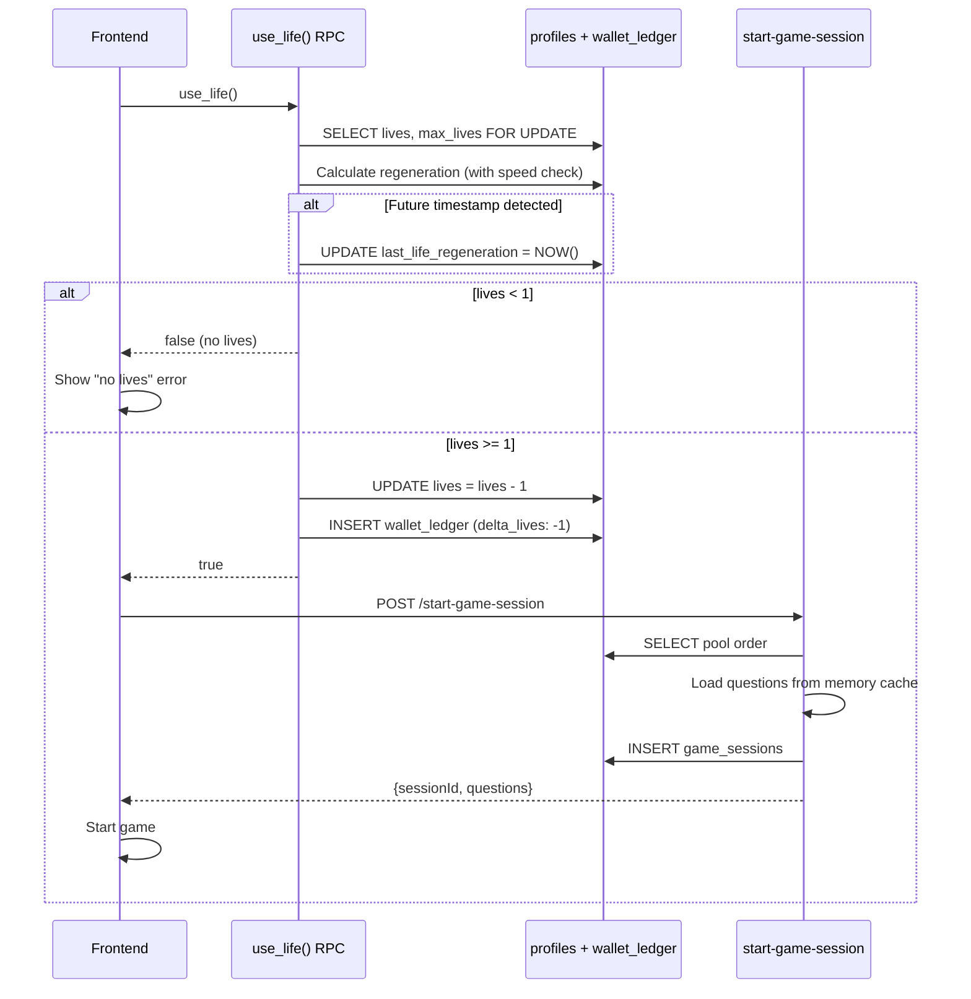
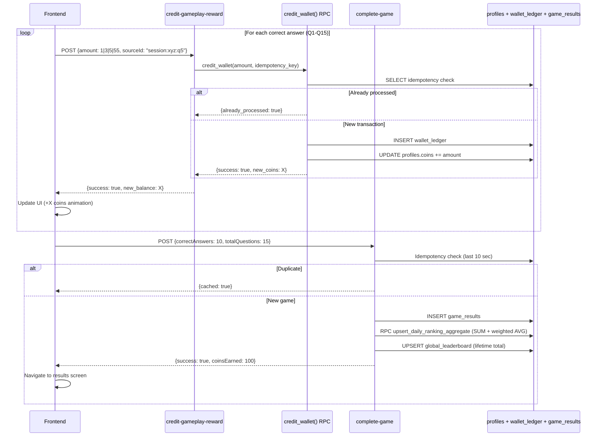
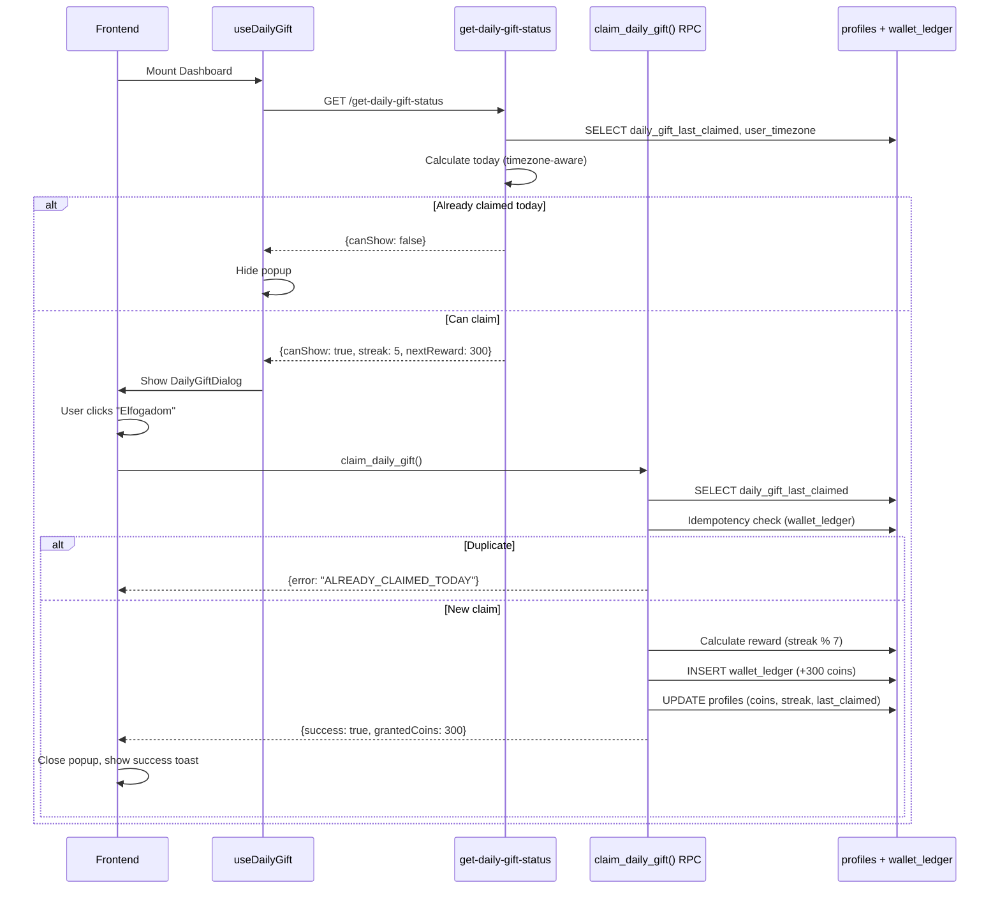
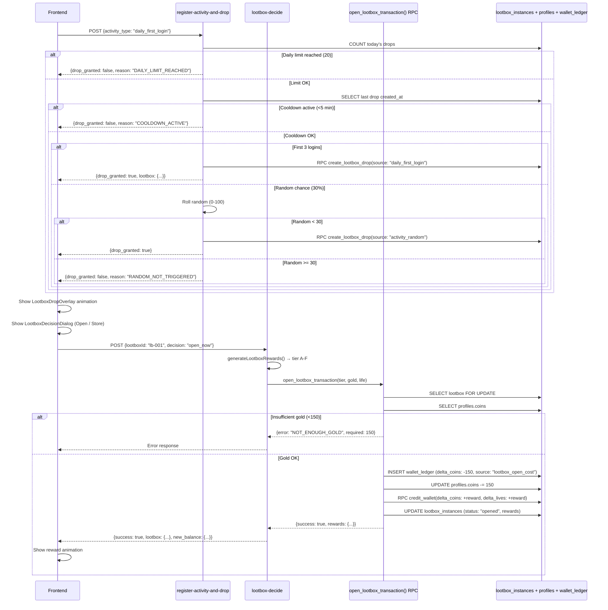
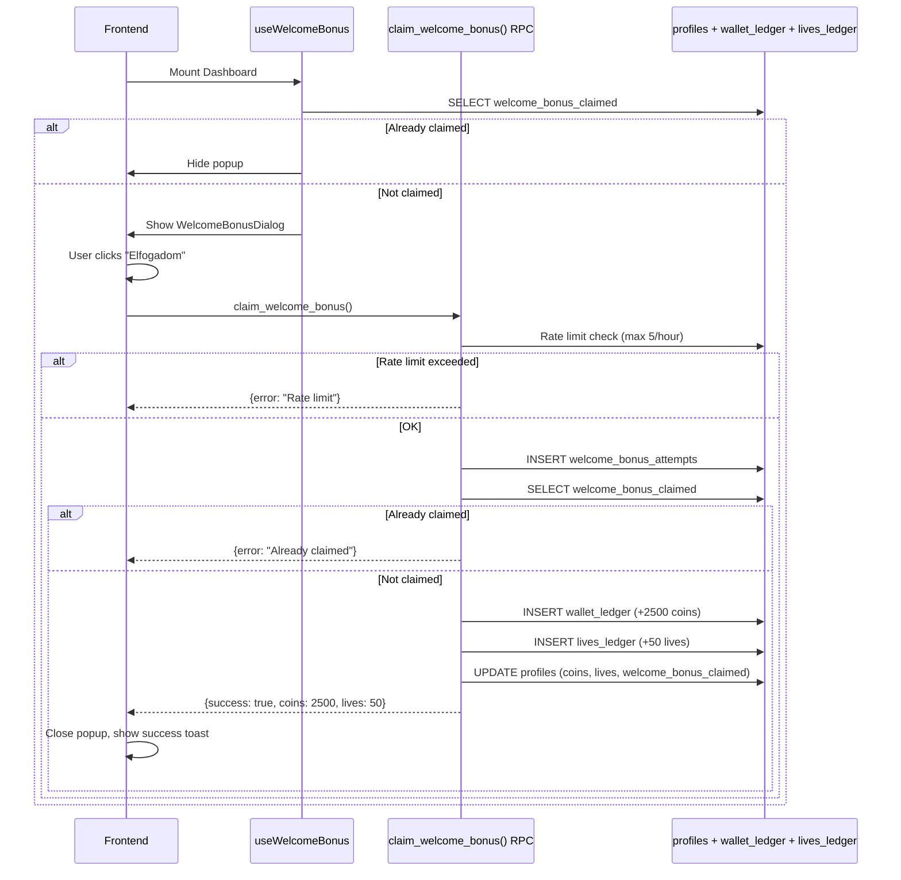
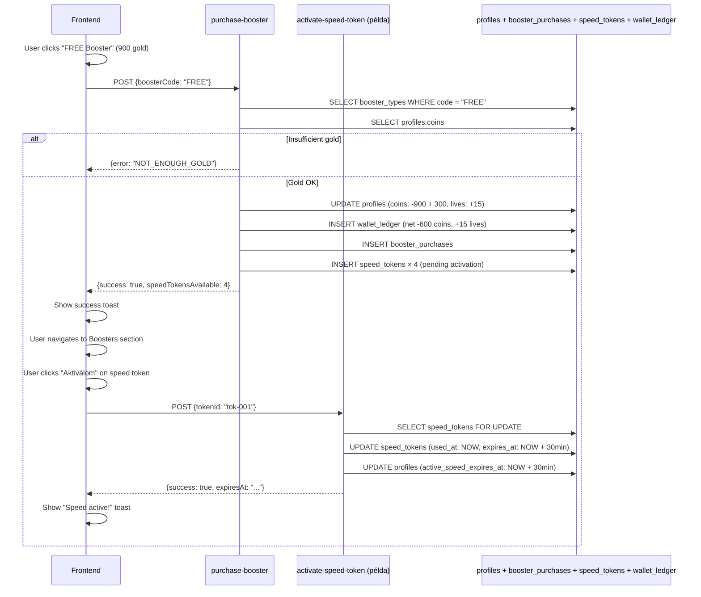

```mermaid
graph TB
    %% FRONTEND
    FE[Frontend React App]
    
    %% CORE WALLET HOOKS
    WH[useWallet Hook]
    DGH[useDailyGift Hook]
    WBH[useWelcomeBonus Hook]
    LBH[useLootbox Hooks]
    BSH[useBooster Hooks]
    
    %% EDGE FUNCTIONS
    GetWallet[get-wallet]
    StartGame[start-game-session]
    CompleteGame[complete-game]
    CreditReward[credit-gameplay-reward]
    ClaimDaily[claim_daily_gift RPC]
    ClaimWelcome[claim_welcome_bonus RPC]
    LootboxDecide[lootbox-decide]
    LootboxOpen[lootbox-open-stored]
    PurchaseBooster[purchase-booster]
    
    %% RPC FUNCTIONS
    CreditWallet[credit_wallet RPC]
    CreditLives[credit_lives RPC]
    UseLife[use_life RPC]
    RegenLives[regenerate_lives_background RPC]
    
    %% DATABASE TABLES
    Profiles[(profiles)]
    WalletLedger[(wallet_ledger)]
    LivesLedger[(lives_ledger)]
    SpeedTokens[(speed_tokens)]
    LootboxInstances[(lootbox_instances)]
    BoosterTypes[(booster_types)]
    BoosterPurchases[(booster_purchases)]
    
    %% FRONTEND ‚Üí HOOKS
    FE --> WH
    FE --> DGH
    FE --> WBH
    FE --> LBH
    FE --> BSH
    
    %% HOOKS ‚Üí EDGE FUNCTIONS
    WH --> GetWallet
    FE --> StartGame
    FE --> CompleteGame --> CreditReward
    DGH --> ClaimDaily
    WBH --> ClaimWelcome
    LBH --> LootboxDecide
    LBH --> LootboxOpen
    BSH --> PurchaseBooster
    
    %% EDGE FUNCTIONS ‚Üí RPC
    GetWallet --> Profiles
    GetWallet --> SpeedTokens
    StartGame --> UseLife
    CreditReward --> CreditWallet
    ClaimDaily --> CreditWallet
    ClaimWelcome --> CreditWallet
    LootboxDecide --> CreditWallet
    LootboxOpen --> CreditWallet
    PurchaseBooster --> CreditWallet
    
    %% RPC ‚Üí TABLES
    CreditWallet --> Profiles
    CreditWallet --> WalletLedger
    CreditLives --> Profiles
    CreditLives --> LivesLedger
    UseLife --> Profiles
    UseLife --> WalletLedger
    
    %% BACKGROUND JOBS
    RegenLives --> Profiles
    
    %% ADDITIONAL CONNECTIONS
    PurchaseBooster --> SpeedTokens
    LootboxDecide --> LootboxInstances
    LootboxOpen --> LootboxInstances
    PurchaseBooster --> BoosterTypes
    PurchaseBooster --> BoosterPurchases
    
    style FE fill:#3b82f6,color:#fff
    style Profiles fill:#dc2626,color:#fff
    style WalletLedger fill:#dc2626,color:#fff
    style LivesLedger fill:#dc2626,color:#fff
    style CreditWallet fill:#10b981,color:#fff
    style CreditLives fill:#10b981,color:#fff
    style UseLife fill:#10b981,color:#fff
```

# 🪙 DINGLEUP! REWARD ECONOMY RENDSZER — TELJES TECHNIKAI DOKUMENTÁCIÓ (v1.0, 2025-12-01)

---

## 0. TARTALOMJEGYZÉK

1. [Rendszer áttekintés és architektúra](#1-rendszer-áttekintés-és-architektúra)
2. [Database Layer (Minden Tábla + Indexek + RLS)](#2-database-layer)
3. [RPC Functions](#3-rpc-functions)
4. [Edge Functions](#4-edge-functions)
5. [Frontend integráció](#5-frontend-integráció)
6. [Teljes Reward Economy szabályok](#6-teljes-reward-economy-szabályok)
7. [Bottleneck-ok és kockázatok](#7-bottleneck-ok-és-kockázatok)
8. [Optimalizálási javaslatok](#8-optimalizálási-javaslatok)
9. [Kritikus folyamat diagramok](#9-kritikus-folyamat-diagramok)

---

## 1. RENDSZER ÁTTEKINTÉS ÉS ARCHITEKTÚRA

### 1.1 Rendszer célja

A DingleUP! Reward Economy rendszer **három fő valutát** kezel:
1. **Aranyérmék (Coins)** — jutalom helyes válaszokért, vásárlásokhoz használható
2. **Életek (Lives)** — játék indításához szükséges, idővel regenerálódik
3. **Speed Boosterek** — élet-regenerációt 2x gyorsítják (12 perc → 6 perc)

A rendszer további elemei:
- **Lootbox Drop & Opening** — napi drop rendszer jutalomdobozokkal
- **Daily Gift** — napi bejelentkezési jutalom streak alapon
- **Welcome Bonus** — egyszeri kezdő jutalom (2500 gold + 50 élet)
- **Daily Rank Rewards** — napi leaderboard helyezések jutalmai
- **Boosterek** — vásárolható csomagok (Free, Premium, Gold Saver, Instant Rescue)

---

### 1.2 Architektúra diagram



---

### 1.3 Fő komponensek

| Komponens | Típus | Felelősség |
|-----------|-------|------------|
| **profiles** | Tábla | Fő egyenlegek (coins, lives, max_lives, regeneration rate) |
| **wallet_ledger** | Tábla | Coin és life tranzakciók naplója (idempotens) |
| **lives_ledger** | Tábla | Csak life tranzakciók naplója |
| **speed_tokens** | Tábla | Speed booster tokenek (aktiválás + lejárat) |
| **lootbox_instances** | Tábla | Lootbox dropok és openings |
| **booster_types** | Tábla | Booster típusok definíciói |
| **booster_purchases** | Tábla | Booster vásárlások története |
| **credit_wallet()** | RPC | Idempotens coin/life jóváírás |
| **credit_lives()** | RPC | Idempotens life jóváírás |
| **use_life()** | RPC | Élet levonása játékindításnál |
| **regenerate_lives_background()** | RPC | Háttér élet-regeneráció (cron) |
| **get-wallet** | Edge Function | Egyenleg lekérés + in-line regeneráció |
| **start-game-session** | Edge Function | Játék indítás + life deduction |
| **complete-game** | Edge Function | Játék befejezés statisztikák |
| **credit-gameplay-reward** | Edge Function | Helyes válasz jutalom jóváírás |
| **lootbox-decide** | Edge Function | Lootbox döntés (open/store) |
| **lootbox-open-stored** | Edge Function | Tárolt lootbox megnyitás |
| **purchase-booster** | Edge Function | Booster vásárlás kezelés |

---

## 2. DATABASE LAYER

### 2.1 `profiles` tábla (Fő wallet state)

**Séma:**
```sql
CREATE TABLE public.profiles (
  id UUID PRIMARY KEY REFERENCES auth.users(id) ON DELETE CASCADE,
  username TEXT NOT NULL UNIQUE,
  email TEXT UNIQUE,
  
  -- WALLET STATE (FÉSZÁLLAPOT)
  coins INTEGER DEFAULT 0,
  lives INTEGER DEFAULT 15,
  max_lives INTEGER DEFAULT 15,
  lives_regeneration_rate INTEGER DEFAULT 12,
  last_life_regeneration TIMESTAMPTZ DEFAULT NOW(),
  
  -- SPEED BOOSTER STATE
  active_speed_expires_at TIMESTAMPTZ,
  
  -- DAILY GIFT STATE
  daily_gift_streak INTEGER DEFAULT 0,
  daily_gift_last_claimed TIMESTAMPTZ,
  daily_gift_last_seen DATE,
  
  -- WELCOME BONUS STATE
  welcome_bonus_claimed BOOLEAN DEFAULT FALSE,
  
  -- METAADATOK
  created_at TIMESTAMPTZ DEFAULT NOW(),
  updated_at TIMESTAMPTZ DEFAULT NOW()
);
```

**Indexek:**
```sql
CREATE INDEX idx_profiles_lives_regen ON profiles(lives, last_life_regeneration) 
WHERE lives < max_lives;

CREATE INDEX idx_profiles_speed_expires ON profiles(active_speed_expires_at) 
WHERE active_speed_expires_at IS NOT NULL;

CREATE INDEX idx_profiles_username_lower ON profiles(lower(username));
```

**RLS Policies:**
```sql
-- SELECT: Users can view their own profile
CREATE POLICY "Users can view their own profile"
ON profiles FOR SELECT
USING (auth.uid() = id);

-- UPDATE: Users can update their own profile
CREATE POLICY "Users can update their own profile"
ON profiles FOR UPDATE
USING (auth.uid() = id);
```

**Példa sorok:**
```json
{
  "id": "abc-123",
  "username": "Player1",
  "coins": 1250,
  "lives": 12,
  "max_lives": 15,
  "lives_regeneration_rate": 12,
  "last_life_regeneration": "2025-12-01T10:30:00Z",
  "active_speed_expires_at": "2025-12-01T12:00:00Z",
  "daily_gift_streak": 5,
  "daily_gift_last_claimed": "2025-12-01T08:00:00Z",
  "welcome_bonus_claimed": true
}
```

**Kritikus mezők:**
- `coins`: Jelenlegi aranyérme egyenleg
- `lives`: Jelenlegi életek száma
- `max_lives`: Maximum életek (15 alapértelmezett, lehet magasabb bonuszokból)
- `lives_regeneration_rate`: Percek száma 1 élet regenerálásához (12 alap, 6 speed boosterrel)
- `last_life_regeneration`: Utolsó regeneráció időpontja
- `active_speed_expires_at`: Ha nem NULL, akkor aktív speed booster van

**Bottleneck-ok:**
- Nincs particionálás → nagy user-count esetén teljes tábla scan
- Sok frissítés (minden játék, minden jutalom) → write contention
- `last_life_regeneration` future timestamp guard szükséges (lásd RPC)

---

### 2.2 `wallet_ledger` tábla (Minden coin/life tranzakció)

**Séma:**
```sql
CREATE TABLE public.wallet_ledger (
  id UUID PRIMARY KEY DEFAULT gen_random_uuid(),
  user_id UUID NOT NULL REFERENCES profiles(id) ON DELETE CASCADE,
  delta_coins INTEGER NOT NULL DEFAULT 0,
  delta_lives INTEGER NOT NULL DEFAULT 0,
  source TEXT NOT NULL CHECK (source IN (
    'welcome', 'daily', 'speed_tick', 'purchase', 'refund', 
    'admin', 'game_reward', 'invitation', 'weekly_reward', 
    'booster_purchase', 'life_purchase', 'lootbox_reward', 'lootbox_open_cost'
  )),
  idempotency_key TEXT UNIQUE NOT NULL,
  metadata JSONB DEFAULT '{}'::jsonb,
  created_at TIMESTAMPTZ DEFAULT NOW()
);
```

**Indexek:**
```sql
CREATE INDEX idx_wallet_ledger_user_created 
ON wallet_ledger(user_id, created_at DESC);

CREATE UNIQUE INDEX idx_wallet_ledger_idempotency 
ON wallet_ledger(idempotency_key);

CREATE INDEX idx_wallet_ledger_source 
ON wallet_ledger(source);
```

**RLS Policies:**
```sql
-- SELECT: Users can view their own ledger
CREATE POLICY "Users can view their own ledger"
ON wallet_ledger FOR SELECT
USING (auth.uid() = user_id);

-- INSERT: Service role only (via RPC)
-- No direct INSERT policy for users
```

**Példa sorok:**
```json
{
  "id": "tx-001",
  "user_id": "abc-123",
  "delta_coins": 5,
  "delta_lives": 0,
  "source": "game_reward",
  "idempotency_key": "game_reward:abc-123:q5",
  "metadata": {"question_index": 5, "session_id": "xyz"},
  "created_at": "2025-12-01T10:35:00Z"
}
```

**Kritikus mezők:**
- `idempotency_key`: **EGYEDI** — duplikált tranzakciók megelőzése
- `delta_coins`: Pozitív = jóváírás, negatív = levonás
- `delta_lives`: Pozitív = jóváírás, negatív = levonás
- `source`: Tranzakció típusa (auditáláshoz)

**Bottleneck-ok:**
- **ROBBANÁSSZERŰ NÖVEKEDÉS** — minden jutalom új sor (15 sor/játék + daily + welcome + lootbox)
- Nincs archíválás → 10M+ játék = 150M+ sor
- `idempotency_key` UNIQUE index → minden INSERT lock contention

**Archíválási stratégia:**
- `wallet_ledger_archive` tábla létezik
- `archive_old_wallet_ledger()` RPC → 90 napnál régebbi sorok archíválása
- Cron: Havonta 1-én 3:00-kor

---

### 2.3 `lives_ledger` tábla (Csak life tranzakciók)

**Séma:**
```sql
CREATE TABLE public.lives_ledger (
  id UUID PRIMARY KEY DEFAULT gen_random_uuid(),
  user_id UUID NOT NULL,
  delta_lives INTEGER NOT NULL,
  source TEXT NOT NULL,
  correlation_id TEXT UNIQUE NOT NULL,
  metadata JSONB DEFAULT '{}'::jsonb,
  created_at TIMESTAMPTZ DEFAULT NOW()
);
```

**Indexek:**
```sql
CREATE INDEX idx_lives_ledger_user_created 
ON lives_ledger(user_id, created_at DESC);

CREATE UNIQUE INDEX lives_ledger_correlation_id_key 
ON lives_ledger(correlation_id);
```

**RLS Policies:**
```sql
-- SELECT: Users can view their own ledger
CREATE POLICY "Users can view their own ledger"
ON lives_ledger FOR SELECT
USING (auth.uid() = user_id);

-- INSERT: Service role only (via RPC)
```

**Példa sorok:**
```json
{
  "id": "liv-001",
  "user_id": "abc-123",
  "delta_lives": 50,
  "source": "welcome",
  "correlation_id": "welcome:abc-123",
  "metadata": {"bonus_type": "welcome"},
  "created_at": "2025-11-30T10:00:00Z"
}
```

**Bottleneck-ok:**
- Duplikált tárolás: `wallet_ledger` is tartalmazza `delta_lives` mezőt
- Nincs praktikus használata (`wallet_ledger` elég lenne)
- Ugyanaz az archíválási kockázat

---

### 2.4 `speed_tokens` tábla (Speed booster tokenek)

**Séma:**
```sql
CREATE TABLE public.speed_tokens (
  id UUID PRIMARY KEY DEFAULT gen_random_uuid(),
  user_id UUID NOT NULL REFERENCES auth.users(id) ON DELETE CASCADE,
  duration_minutes INTEGER NOT NULL,
  source TEXT NOT NULL, -- 'FREE_BOOSTER' | 'PREMIUM_BOOSTER' | 'PURCHASE' | 'REWARD'
  created_at TIMESTAMPTZ DEFAULT NOW(),
  used_at TIMESTAMPTZ,
  expires_at TIMESTAMPTZ
);
```

**Indexek:**
```sql
CREATE INDEX idx_speed_tokens_user_id ON speed_tokens(user_id);
CREATE INDEX idx_speed_tokens_expires ON speed_tokens(expires_at) 
WHERE expires_at IS NOT NULL;
```

**RLS Policies:**
```sql
-- SELECT: Users can view their own tokens
CREATE POLICY "Users can view their own tokens"
ON speed_tokens FOR SELECT
USING (auth.uid() = user_id);

-- Service role manages activation
```

**Példa sorok:**
```json
{
  "id": "tok-001",
  "user_id": "abc-123",
  "duration_minutes": 30,
  "source": "FREE_BOOSTER",
  "created_at": "2025-12-01T10:00:00Z",
  "used_at": "2025-12-01T10:05:00Z",
  "expires_at": "2025-12-01T10:35:00Z"
}
```

**Logika:**
- Token kreálás: `used_at` és `expires_at` = NULL
- Aktiválás: `used_at` = NOW(), `expires_at` = NOW() + duration
- Aktív token: `expires_at > NOW()`
- Lejárt token: `expires_at < NOW()`

**Bottleneck-ok:**
- Nincs automatikus cleanup → lejárt tokenek felhalmozódnak
- `profiles.active_speed_expires_at` denormalizált (optimalizáció)

---

### 2.5 `lootbox_instances` tábla (Lootbox dropok és nyitások)

**Séma:**
```sql
CREATE TABLE public.lootbox_instances (
  id UUID PRIMARY KEY DEFAULT gen_random_uuid(),
  user_id UUID NOT NULL,
  status TEXT NOT NULL, -- 'active_drop' | 'stored' | 'opened' | 'expired'
  source TEXT NOT NULL, -- 'daily_first_login' | 'activity_random' | 'purchase'
  
  created_at TIMESTAMPTZ DEFAULT NOW(),
  activated_at TIMESTAMPTZ,
  opened_at TIMESTAMPTZ,
  expires_at TIMESTAMPTZ,
  
  rewards_gold INTEGER,
  rewards_life INTEGER,
  open_cost_gold INTEGER DEFAULT 150,
  metadata JSONB
);
```

**Indexek:**
```sql
CREATE INDEX idx_lootbox_instances_user_id ON lootbox_instances(user_id);
CREATE INDEX idx_lootbox_instances_status ON lootbox_instances(status);
CREATE INDEX idx_lootbox_instances_user_status ON lootbox_instances(user_id, status);
```

**RLS Policies:**
```sql
-- SELECT: Users can view their own lootboxes
CREATE POLICY "Users can view their own lootboxes"
ON lootbox_instances FOR SELECT
USING (auth.uid() = user_id);

-- Service role manages creation/updates
```

**Példa sorok:**
```json
{
  "id": "lb-001",
  "user_id": "abc-123",
  "status": "stored",
  "source": "daily_first_login",
  "created_at": "2025-12-01T09:00:00Z",
  "activated_at": null,
  "opened_at": null,
  "expires_at": null,
  "rewards_gold": null,
  "rewards_life": null,
  "open_cost_gold": 150,
  "metadata": {"daily_sequence": 1, "login_number": 1}
}
```

**Status state machine:**
1. `active_drop` → felugró animáció közben
2. `stored` → felhasználó eldöntötte hogy tárolja
3. `opened` → megnyitva, jutalmak jóváírva
4. `expired` → nem nyitotta meg időben (ha van `expires_at`)

**Bottleneck-ok:**
- Nincs cleanup → régi `opened` és `expired` sorok felhalmozódnak
- Napi 20 drop/user = 20 sor/nap/user = 7300 sor/év/user

---

### 2.6 `booster_types` tábla (Booster definíciók)

**Séma:**
```sql
CREATE TABLE public.booster_types (
  id UUID PRIMARY KEY DEFAULT gen_random_uuid(),
  code TEXT NOT NULL UNIQUE, -- 'FREE' | 'PREMIUM' | 'GOLD_SAVER' | 'INSTANT_RESCUE'
  name TEXT NOT NULL,
  description TEXT,
  is_active BOOLEAN DEFAULT TRUE,
  
  -- COST
  price_gold INTEGER,
  price_usd_cents INTEGER,
  
  -- REWARDS
  reward_gold INTEGER DEFAULT 0,
  reward_lives INTEGER DEFAULT 0,
  reward_speed_count INTEGER DEFAULT 0,
  reward_speed_duration_min INTEGER DEFAULT 0,
  
  created_at TIMESTAMPTZ DEFAULT NOW(),
  updated_at TIMESTAMPTZ DEFAULT NOW()
);
```

**Jelenlegi booster típusok:**

| Code | Price | Rewards | Megjegyzés |
|------|-------|---------|------------|
| **FREE** | 900 gold | +300 gold, +15 élet, 4× 30min speed | Aranyért vásárolható |
| **PREMIUM** | $2.49 USD | +1500 gold, +50 élet, 24× 60min speed | IAP Stripe payment |
| **GOLD_SAVER** | 500 gold | +250 gold, +15 élet | In-game arany booster (Speed nélkül) |
| **INSTANT_RESCUE** | $1.49 USD | +1000 gold, +25 élet | In-game IAP booster (Speed nélkül) |

**RLS Policies:**
```sql
-- SELECT: Anyone can view active boosters
CREATE POLICY "Anyone can view active boosters"
ON booster_types FOR SELECT
USING (is_active = true);

-- Admins can manage
CREATE POLICY "Admins can manage booster types"
ON booster_types FOR ALL
USING (has_role(auth.uid(), 'admin'));
```

---

### 2.7 `booster_purchases` tábla (Booster vásárlások log)

**Séma:**
```sql
CREATE TABLE public.booster_purchases (
  id UUID PRIMARY KEY DEFAULT gen_random_uuid(),
  user_id UUID NOT NULL,
  booster_type_id UUID NOT NULL REFERENCES booster_types(id),
  
  purchase_source TEXT NOT NULL, -- 'GOLD' | 'IAP'
  gold_spent INTEGER DEFAULT 0,
  usd_cents_spent INTEGER DEFAULT 0,
  iap_transaction_id TEXT,
  
  purchase_context TEXT, -- 'PROFILE' | 'DASHBOARD' | 'IN_GAME'
  created_at TIMESTAMPTZ DEFAULT NOW()
);
```

**Indexek:**
```sql
CREATE INDEX idx_booster_purchases_user_id ON booster_purchases(user_id);
CREATE INDEX idx_booster_purchases_user_created 
ON booster_purchases(user_id, created_at DESC);
```

**RLS Policies:**
```sql
-- SELECT: Users can view own purchases
CREATE POLICY "Users can view own purchases"
ON booster_purchases FOR SELECT
USING (auth.uid() = user_id);

-- INSERT: Users can insert own purchases
CREATE POLICY "Users can insert own purchases"
ON booster_purchases FOR INSERT
WITH CHECK (auth.uid() = user_id);
```

---

## 3. RPC FUNCTIONS

### 3.1 `credit_wallet()`

**Paraméterek:**
```sql
CREATE FUNCTION credit_wallet(
  p_user_id UUID,
  p_delta_coins INTEGER,
  p_delta_lives INTEGER,
  p_source TEXT,
  p_idempotency_key TEXT,
  p_metadata JSONB DEFAULT '{}'::jsonb
) RETURNS JSONB
```

**Logika:**
1. **Idempotencia check:** Ha `idempotency_key` már létezik → visszaad `{already_processed: true}`
2. **Balance check:** Ha negatív delta és nincs elég → visszaad `{error: 'Insufficient funds'}`
3. **Ledger insert:** `wallet_ledger` táblába ír
4. **Profile update:** `profiles.coins` és `profiles.lives` frissítés
5. **Return:** `{success: true, new_coins: X, new_lives: Y}`

**Edge cases:**
- Duplikált hívás → silent success (idempotencia)
- Negatív delta nagyobb mint egyenleg → error
- Concurrent hívások → ledger UNIQUE index garantálja

**Performance:**
- 2 DB query (idempotency check + upsert)
- ~15-25ms (optimális esetben)

**Példa hívás:**
```typescript
const { data, error } = await supabase.rpc('credit_wallet', {
  p_user_id: userId,
  p_delta_coins: 5,
  p_delta_lives: 0,
  p_source: 'game_reward',
  p_idempotency_key: `game_reward:${userId}:q${questionIndex}`,
  p_metadata: { question_index: questionIndex }
});
```

---

### 3.2 `credit_lives()`

**Paraméterek:**
```sql
CREATE FUNCTION credit_lives(
  p_user_id UUID,
  p_delta_lives INTEGER,
  p_source TEXT,
  p_idempotency_key TEXT,
  p_metadata JSONB DEFAULT '{}'::jsonb
) RETURNS JSON
```

**Logika:**
Ugyanaz mint `credit_wallet()`, de csak `delta_lives` mezővel.

**Megjegyzés:**
- Redundáns, `credit_wallet()` is tudja
- Használat: Daily rank reward életekhez

---

### 3.3 `use_life()`

**Paraméterek:**
```sql
CREATE FUNCTION use_life() RETURNS BOOLEAN
```

**Logika:**
1. **User azonosítás:** `auth.uid()`
2. **Life fetch + lock:** `SELECT lives, max_lives, lives_regeneration_rate, last_life_regeneration FROM profiles WHERE id = auth.uid() FOR UPDATE`
3. **Speed check:** Ellenőrzi `active_speed_expires_at > NOW()` → ha igen, regen rate / 2
4. **Regeneráció számítás:**
   - Ha `last_life_regeneration > NOW()` → normalize to NOW() (CRITICAL FIX)
   - Számolt regenerált életekget hozzáadás (de max `max_lives`-ig)
5. **Life deduction:** `lives - 1`
6. **Ledger log:** `wallet_ledger` INSERT (`delta_lives: -1, source: 'game_start'`)
7. **Return:** `true` ha sikeres, `false` ha nincs elég élet

**CRITICAL FIX:**
```sql
IF last_life_regeneration > NOW() THEN
  last_life_regeneration := NOW();
  -- Update profile to normalize timestamp
END IF;
```

**Edge cases:**
- Felhasználó 0 élettel → `false` return
- Bonus életekkel (pl. 18/15) → működik, levon 1-et
- Future timestamp guard → időutazás exploit prevention

---

### 3.4 `regenerate_lives_background()`

**Paraméterek:**
```sql
CREATE FUNCTION regenerate_lives_background() RETURNS VOID
```

**Logika:**
1. **Minden user loop:** `SELECT id, lives, max_lives, lives_regeneration_rate, last_life_regeneration, active_speed_expires_at FROM profiles`
2. **Filter:** Csak `lives < max_lives` userek
3. **Speed check:** Ha `active_speed_expires_at > NOW()` → regen rate / 2
4. **Timestamp validation:** Ha `last_life_regeneration > NOW()` → normalize to NOW()
5. **Regeneráció számítás:** `FLOOR(minutes_passed / regen_rate)`
6. **Profile update:** `lives = MIN(lives + regenerated, max_lives)`
7. **Timestamp update:** `last_life_regeneration = last_regen + (regenerated * interval)`

**Cron:**
```toml
# Runs every 1 minute
[[edge_runtime.cron]]
schedule = "* * * * *"
function = "regenerate-lives-background"
```

**Performance:**
- Full table scan minden percben
- 10K user = ~2-3s execution time
- **OPTIMALIZÁCIÓ:** Denormalizált `active_speed_expires_at` a `profiles` táblában (nincs subquery)

---

### 3.5 `claim_daily_gift()`

**Paraméterek:**
```sql
CREATE FUNCTION claim_daily_gift() RETURNS JSONB
```

**Logika:**
1. **User azonosítás:** `auth.uid()`
2. **Profile fetch:** `daily_gift_streak`, `daily_gift_last_claimed`, `user_timezone`
3. **Today check (timezone-aware):** `TO_CHAR(NOW() AT TIME ZONE timezone, 'YYYY-MM-DD')`
4. **Already claimed check:** Ha `last_claimed_date == today` → error
5. **Idempotency check:** `wallet_ledger` WHERE `idempotency_key = 'daily-gift:${userId}:${today}'`
6. **Streak számítás:** `cycle_position = streak % 7`
7. **Reward mapping:**
   - Day 0: 50 gold
   - Day 1: 75 gold
   - Day 2: 110 gold
   - Day 3: 160 gold
   - Day 4: 220 gold
   - Day 5: 300 gold
   - Day 6: 500 gold
8. **Credit:** `wallet_ledger` INSERT + `profiles.coins` UPDATE
9. **Profile update:** `daily_gift_streak++`, `daily_gift_last_claimed = NOW()`, `daily_gift_last_seen = today`
10. **Return:** `{success: true, grantedCoins: X, walletBalance: Y, streak: Z}`

**Edge cases:**
- Duplikált hívás → `ALREADY_CLAIMED_TODAY`
- User timezone NULL → fallback to UTC
- Streak reset logic (ha nem jön be 24 órán belül) → **NINCS IMPLEMENTÁLVA**

---

### 3.6 `claim_welcome_bonus()`

**Paraméterek:**
```sql
CREATE FUNCTION claim_welcome_bonus() RETURNS JSON
```

**Logika:**
1. **User azonosítás:** `auth.uid()`
2. **Profile fetch:** `welcome_bonus_claimed`, `coins`, `lives`
3. **Already claimed check:** Ha `welcome_bonus_claimed == true` → error
4. **Rate limiting:** `check_rate_limit('claim_welcome_bonus', 5, 60)` → max 5 attempt / 60 perc
5. **Attempt tracking:** `welcome_bonus_attempts` INSERT/UPDATE
6. **Credit:** `wallet_ledger` INSERT (coins: +2500) és `lives_ledger` INSERT (lives: +50)
7. **Profile update:** 
   - `coins = coins + 2500`
   - `lives = lives + 50`
   - `welcome_bonus_claimed = true`
8. **Return:** `{success: true, coins: 2500, lives: 50}`

**Security:**
- Rate limiting 5 attempt/óra
- Server-side tracking (`welcome_bonus_attempts` tábla)
- Idempotens wallet crediting

---

## 4. EDGE FUNCTIONS

### 4.1 `get-wallet`

**Endpoint:** POST `/functions/v1/get-wallet`

**Auth:** JWT required

**Request:**
```typescript
// Query params (optional):
?fields=livesCurrent,livesMax,coinsCurrent,nextLifeAt
```

**Logika:**
1. **Auth:** JWT validation
2. **Profile fetch:** `SELECT coins, lives, max_lives, last_life_regeneration, lives_regeneration_rate FROM profiles WHERE id = user_id`
3. **Speed token check:** `SELECT * FROM speed_tokens WHERE user_id = X AND expires_at > NOW() ORDER BY expires_at DESC LIMIT 1`
4. **Regen rate kalkuláció:** Ha speed aktív → regen_rate / 2
5. **In-line regeneráció:**
   - **Timestamp guard:** Ha `last_life_regeneration > NOW()` → normalize to NOW() + DB UPDATE
   - Számolt regenerált életeket hozzáadás
   - `nextLifeAt` kalkuláció
6. **Ledger fetch (conditional):** Ha `fields` param nincs vagy tartalmazza `ledger` → utolsó 20 tranzakció
7. **Response build (field filtering):** Csak a kért mezőket adja vissza

**Response:**
```typescript
{
  livesCurrent: 12,
  livesMax: 15,
  coinsCurrent: 1250,
  nextLifeAt: "2025-12-01T10:42:00Z",
  regenIntervalSec: 360,
  regenMinutes: 6,
  ledger: [...],
  activeSpeedToken: { id: "...", expiresAt: "...", durationMinutes: 30 }
}
```

**Performance:**
- Field filtering → 30-40% payload reduction
- In-line regeneráció → nincs külön RPC hívás
- ~35-55ms response time

**Edge cases:**
- Future timestamp → auto-fix + DB update
- Multiple concurrent calls → race condition a regeneráció UPDATE-nél

---

### 4.2 `start-game-session`

**Endpoint:** POST `/functions/v1/start-game-session`

**Auth:** JWT required

**Request:**
```typescript
{ lang?: "hu" | "en" }
```

**Logika:**
1. **Auth:** JWT validation
2. **Rate limiting:** 10 hívás / 1 perc
3. **Parallel DB queries:**
   - User preferred language
   - Last pool order (`game_session_pools`)
4. **Pool cache init:** Betölti mind a 15 pool-t (hu + en) memóriába (első híváskor)
5. **Pool rotation:** `nextPoolOrder = (lastPoolOrder % 15) + 1`
6. **Question selection:** 15 random kérdés a következő pool-ból (memóriából, 0 DB query!)
7. **Pool session update:** `game_session_pools` UPSERT
8. **Game session create:** `game_sessions` INSERT
9. **Life deduction:** **NINCS IMPLEMENTÁLVA EBBEN A FUNCTIONBEN**
   - Frontend külön hívja a `use_life()` RPC-t **ELŐTTE**

**Response:**
```typescript
{
  sessionId: "xyz",
  questions: [...15 kérdés...],
  poolUsed: 3,
  lang: "hu",
  performance: {
    parallel_queries_ms: 45,
    question_selection_ms: 2,
    db_queries_for_questions: 0
  }
}
```

**CRITICAL:** A life deduction a **frontendon** történik `use_life()` RPC hívással MIELŐTT `start-game-session`-t hívná.

**Performance:**
- **ZERO DB query** a kérdésekhez (in-memory pool cache)
- Dual-language cache (hu + en)
- ~35-55ms total response time

---

### 4.3 `credit-gameplay-reward`

**Endpoint:** POST `/functions/v1/credit-gameplay-reward`

**Auth:** JWT required

**Request:**
```typescript
{
  amount: 1 | 3 | 5 | 55,
  sourceId: "session:xyz:q5",
  reason?: "correct_answer"
}
```

**Logika:**
1. **Auth:** JWT validation
2. **Rate limiting:** 15 hívás / 1 perc
3. **Input validation:** `amount` 1-1000 között
4. **Idempotency key:** `game_reward:${userId}:${sourceId}`
5. **Credit:** `credit_wallet()` RPC hívás
6. **Return:** `{success: true, amount: X, new_balance: Y}`

**Response:**
```typescript
{
  success: true,
  amount: 5,
  new_balance: 1255,
  transaction_id: "game_reward:abc-123:session:xyz:q5"
}
```

**Idempotencia:**
- Minden kérdés egyedi `sourceId` (`session:xyz:q${questionIndex}`)
- Duplikált hívás → `wallet_ledger` UNIQUE constraint → silent success

**Performance:**
- 1 RPC call → ~15-25ms

---

### 4.4 `complete-game`

**Endpoint:** POST `/functions/v1/complete-game`

**Auth:** JWT required

**Request:**
```typescript
{
  category: "mixed",
  correctAnswers: 0-15,
  totalQuestions: 15,
  averageResponseTime: 5000 (ms)
}
```

**Logika:**
1. **Auth:** JWT validation
2. **Rate limiting:** 10 hívás / 1 perc
3. **Input validation:** `correctAnswers` 0-15, `totalQuestions` == 15
4. **Coins kalkuláció (CSAK STATISZTIKÁHOZ):**
   - Start jutalom: 1 coin
   - Q1-4: 1 coin/kérdés
   - Q5-9: 3 coin/kérdés
   - Q10-14: 5 coin/kérdés
   - Q15: 55 coin
5. **Idempotency check:** Utolsó 10 másodpercben ugyanilyen `correctAnswers` + `totalQuestions` → cached return
6. **Game result INSERT:** `game_results` tábla
7. **Daily rankings aggregáció:** `upsert_daily_ranking_aggregate()` RPC (SUM + weighted AVG)
8. **Global leaderboard aggregáció:** `global_leaderboard` UPSERT (lifetime total)
9. **Return:** `{success: true, coinsEarned: X}`

**CRITICAL:**
- **NEM ír jóvá coinokat** — az már megtörtént minden helyes válasz után (`credit-gameplay-reward`)
- Csak statisztikát rögzít

**Performance:**
- Idempotencia check: ~5ms
- Game result insert: ~10ms
- Daily ranking RPC: ~20ms
- Global leaderboard upsert: ~15ms
- **Total: ~50ms**

---

### 4.5 `lootbox-decide`

**Endpoint:** POST `/functions/v1/lootbox-decide`

**Auth:** JWT required

**Request:**
```typescript
{
  lootboxId: "lb-001",
  decision: "open_now" | "store"
}
```

**Logika:**

**Ha `decision === 'store'`:**
1. **Lootbox fetch:** WHERE `status = 'active_drop'`
2. **Update:** `status = 'stored'`, `expires_at = NULL`
3. **Return:** `{success: true, lootbox: {...}, message: "Stored"}`

**Ha `decision === 'open_now'`:**
1. **Lootbox fetch:** WHERE `status = 'active_drop'`
2. **Reward generálás:** `generateLootboxRewards()` — tier-based probabilities
   - A tier (35%): 75 gold + 4 élet
   - B tier (30%): 120 gold + 5 élet
   - C tier (18%): 150 gold + 6 élet
   - D tier (10%): 225 gold + 8 élet
   - E tier (5%): 500 gold + 15 élet
   - F tier (2%): 1000 gold + 25 élet
3. **Transaction:** `open_lootbox_transaction()` RPC:
   - Gold check (150 gold cost)
   - Gold deduct (`wallet_ledger` INSERT: -150)
   - Rewards credit (`credit_wallet()`)
   - Lootbox update (`status = 'opened'`, `rewards_gold`, `rewards_life`)
4. **Return:** `{success: true, lootbox: {...}, rewards: {...}, new_balance: {...}}`

**Edge cases:**
- Nincs elég gold → `{error: 'NOT_ENOUGH_GOLD', required: 150, current: X}`
- Lootbox már feldolgozva → 404

---

### 4.6 `lootbox-open-stored`

**Endpoint:** POST `/functions/v1/lootbox-open-stored`

**Auth:** JWT required

**Request:**
```typescript
{
  lootboxId: "lb-002"
}
```

**Logika:**
Ugyanaz mint `lootbox-decide` `open_now` ága, de:
1. **Lootbox fetch:** WHERE `status = 'stored'`
2. **Open cost meghatározás:**
   - Ha `source === 'purchase'` → 0 gold (ingyen nyitható)
   - Egyébként → 150 gold
3. **Transaction:** `open_lootbox_transaction()` RPC (ugyanaz)

---

### 4.7 `purchase-booster`

**Endpoint:** POST `/functions/v1/purchase-booster`

**Auth:** JWT required

**Request:**
```typescript
{
  boosterCode: "FREE" | "PREMIUM" | "GOLD_SAVER" | "INSTANT_RESCUE",
  confirmInstantPurchase?: boolean
}
```

**Logika:**

**FREE booster:**
1. **Booster fetch:** `booster_types` WHERE `code = 'FREE'`
2. **Balance check:** `coins >= 900`
3. **Transaction:**
   - `profiles.coins` deduct (-900) + add reward (+300) = -600
   - `profiles.lives` add (+15)
4. **Ledger log:** `wallet_ledger` INSERT
5. **Purchase log:** `booster_purchases` INSERT
6. **Speed tokens create:** 4× 30min tokenek (`used_at = NULL` → pending activation)
7. **Return:** `{success: true, balanceAfter: {...}, grantedRewards: {...}}`

**PREMIUM booster:**
- **CRITICAL SECURITY ISSUE:** Simulated payment **REMOVED**
- **Real implementation:** User MUST call `create-premium-booster-payment` → Stripe checkout
- **Response:** `{error: "STRIPE_PAYMENT_REQUIRED", requiresStripeCheckout: true}`

**GOLD_SAVER booster:**
1. **Balance check:** `coins >= 500`
2. **Transaction:** -500 + 250 = -250 gold, +15 élet
3. **NO speed tokens**
4. **Return:** Same as FREE

**INSTANT_RESCUE booster:**
- **IAP only:** Stripe payment required
- **Response:** `{error: "STRIPE_PAYMENT_REQUIRED"}`

---

### 4.8 `register-activity-and-drop`

**Endpoint:** POST `/functions/v1/register-activity-and-drop`

**Auth:** JWT required

**Request:**
```typescript
{
  activity_type: "daily_first_login" | "game_complete" | "profile_view",
  metadata?: {...}
}
```

**Logika:**
1. **Daily limit check:** 20 drop/nap maximum
2. **Cooldown check:** 5 perc az utolsó drop óta
3. **Guaranteed drops (first 3 logins):**
   - Számol `session_start` eventeket ma
   - Ha ≤ 3 → guaranteed drop
   - Ellenőrzi hogy ez a login_number már kapott-e dropot
   - Ha nem → `create_lootbox_drop()` RPC
4. **Random drops (egyéb activity):**
   - 30% chance
   - Ha sikeres → `create_lootbox_drop()` RPC
5. **Return:** `{drop_granted: true/false, lootbox: {...}, reason: "..."}`

**Daily caps:**
- Min 10, max 20 drop/nap
- First 3 login guaranteed (ha nem volt cooldown)
- Utána 5 percenként 30% chance

---

## 5. FRONTEND INTEGRÁCIÓ

### 5.1 `useWallet` hook

**Fájl:** `src/hooks/useWallet.ts`

**Felelősség:**
- Wallet state lekérése (`get-wallet` edge function)
- Real-time frissítés (BroadcastChannel + Supabase realtime)
- Next life timer számítás
- Speed token info

**State:**
```typescript
{
  coins: number;
  lives: number;
  maxLives: number;
  nextLifeAt: string | null;
  regenMinutes: number;
  loading: boolean;
  activeSpeedToken: { ... } | null;
}
```

**Optimalizáció:**
- Field filtering: `?fields=livesCurrent,livesMax,coinsCurrent,nextLifeAt`
- Stale time: 0 (mindig friss)
- Real-time subscription: `wallet_ledger` INSERT → refetch

---

### 5.2 `useDailyGift` hook

**Fájl:** `src/hooks/useDailyGift.ts`

**Felelősség:**
- Daily gift status lekérése (`get-daily-gift-status` edge function)
- Claim action (`claim_daily_gift()` RPC)
- Popup megjelenítés kezelése
- Later/dismiss action (`dismiss-daily-gift` edge function)

**State:**
```typescript
{
  canClaim: boolean;
  showPopup: boolean;
  weeklyEntryCount: number;
  nextReward: number;
  claiming: boolean;
}
```

**Popup logika:**
- Csak naponta egyszer jelenik meg (első bejelentkezéskor)
- Ha user "Later"-t nyom → `daily_gift_last_seen` frissítés → nem jelenik meg újra ma

---

### 5.3 `useWelcomeBonus` hook

**Fájl:** `src/hooks/useWelcomeBonus.ts`

**Felelősség:**
- Welcome bonus ellenőrzés (`profiles.welcome_bonus_claimed`)
- Claim action (`claim_welcome_bonus()` RPC)
- Later/dismiss action (UPDATE `welcome_bonus_claimed = true`)

**State:**
```typescript
{
  canClaim: boolean;
  claiming: boolean;
  loading: boolean;
}
```

**Popup logika:**
- Csak egyszer jelenik meg (ha `welcome_bonus_claimed == false`)
- Ha user "Later"-t nyom → `welcome_bonus_claimed = true` → soha többé nem jelenik meg

**CRITICAL:** User elveszíti a bonuszt ha Later-t nyom!

---

### 5.4 Lootbox hooks

**Fájlok:**
- `src/hooks/useActiveLootbox.ts`
- `src/hooks/useLootboxActivityTracker.ts`
- `src/hooks/useLoginLootboxTracker.ts`

**Felelősség:**
- Aktív drop figyelése (`lootbox_instances` WHERE `status = 'active_drop'`)
- Drop animation trigger
- Decision handling (open/store)
- Stored boxes list

---

### 5.5 UI komponensek

| Komponens | Felelősség |
|-----------|------------|
| **NextLifeTimer** | Next life countdown display |
| **WelcomeBonusDialog** | Welcome bonus popup |
| **DailyGiftDialog** | Daily gift popup |
| **LootboxDropOverlay** | Lootbox drop animation (global overlay) |
| **LootboxDecisionDialog** | Open now / Store later döntés |
| **BoosterButton** | Booster vásárlás gomb |

---

### 5.6 Optimistic vs Server-authoritative

**Optimistic UI:**
- **NINCS** — minden reward server-authoritative
- Coins növekedés csak server response után történik
- Lives levonás csak server response után történik

**Server-authoritative:**
- `use_life()` RPC → csak ha `true` akkor indul a játék
- `credit_gameplay_reward()` → csak ha success akkor frissül a UI
- `claim_daily_gift()` → csak ha success akkor frissül a UI
- `claim_welcome_bonus()` → csak ha success akkor frissül a UI

---

## 6. TELJES REWARD ECONOMY SZABÁLYOK

### 6.1 Lives (Életek)

**Alapértékek:**
- Start: 15 élet
- Maximum: 15 élet (bonus életekkel lehet több, pl. 18/15)
- Regeneráció: 12 perc / 1 élet (alap)
- Speed boosterrel: 6 perc / 1 élet (2x gyorsabb)

**Regeneráció logika:**
```
minutes_passed = (NOW() - last_life_regeneration) / 60
lives_to_add = FLOOR(minutes_passed / regen_rate)
new_lives = MIN(current_lives + lives_to_add, max_lives)
```

**CRITICAL FIX:**
- Ha `current_lives > max_lives` (bonus életekkel) → NEM regenerál tovább
- Ha `last_life_regeneration > NOW()` → normalize to NOW() (időutazás exploit prevention)

**Life deduction:**
- Játék indításkor: -1 élet (`use_life()` RPC)
- Ha 0 élet → játék nem indítható

**Life sources:**
- Welcome bonus: +50 élet (egyszer)
- Daily gift: 0 élet (csak coins)
- Daily rank reward: 0-600 élet (rang függő)
- Lootbox: 4-25 élet (tier függő)
- Booster: 15-50 élet (booster típus függő)

---

### 6.2 Coins (Aranyérmék)

**Alapértékek:**
- Start: 0 coin
- Maximum: Nincs limit

**Coin sources:**
- Welcome bonus: +2500 coin (egyszer)
- Daily gift: 50-500 coin (streak függő)
- Gameplay rewards:
  - Start jutalom: 1 coin
  - Q1-4: 1 coin/kérdés (4 coin total)
  - Q5-9: 3 coin/kérdés (15 coin total)
  - Q10-14: 5 coin/kérdés (25 coin total)
  - Q15: 55 coin
  - **Maximum 1 játékban:** 1 + 4 + 15 + 25 + 55 = **100 coin** (ha mind helyes)
- Daily rank reward: 192-30,000 coin (rang + nap függő)
- Lootbox: 75-1000 coin (tier függő)
- Booster: 250-1500 coin (booster típus függő)

**Coin spending:**
- Lootbox opening: -150 coin (ha nem purchased)
- FREE booster: -900 coin (de ad +300 coinot vissza → nettó -600)
- GOLD_SAVER booster: -500 coin (de ad +250 coinot vissza → nettó -250)

---

### 6.3 Speed Boosterek

**Token system:**
- Token kreálás: `speed_tokens` INSERT (`used_at = NULL`, `expires_at = NULL`)
- Aktiválás: User "Aktiválom" gomb → `used_at = NOW()`, `expires_at = NOW() + duration`
- Lejárat: `expires_at < NOW()` → token inaktív
- Profile denormalizáció: `active_speed_expires_at` = legutolsó aktív token lejárata

**Hatás:**
- Life regeneráció 2x gyorsabb (12 perc → 6 perc)
- Csak akkor aktív ha `active_speed_expires_at > NOW()`

**Sources:**
- FREE booster: 4× 30min token
- PREMIUM booster: 24× 60min token

---

### 6.4 Lootbox Drop System

**Daily caps:**
- Minimum: 10 drop/nap
- Maximum: 20 drop/nap

**Drop rules:**
1. **First 3 logins guaranteed:**
   - 1. bejelentkezés: 1 drop ~1 percen belül
   - 2. bejelentkezés: 1 drop ~1 percen belül
   - 3. bejelentkezés: 1 drop ~1 percen belül
2. **4+ logins: random chance:**
   - 5 perc cooldown az utolsó drop óta
   - 30% chance minden activity után
3. **Offline accumulation: NINCS**
   - Ha user offline → dropok NEM halmozódnak fel

**Opening costs:**
- Daily drop: 150 gold
- Purchased lootbox: 0 gold (ingyen nyitható)

**Rewards (tier-based):**
```
A tier (35%): 75 gold + 4 élet
B tier (30%): 120 gold + 5 élet
C tier (18%): 150 gold + 6 élet
D tier (10%): 225 gold + 8 élet
E tier (5%): 500 gold + 15 élet (Nagy ritka win)
F tier (2%): 1000 gold + 25 élet (Mini Jackpot)
```

**Expected value (EV):**
```
EV_gold = 0.35*75 + 0.30*120 + 0.18*150 + 0.10*225 + 0.05*500 + 0.02*1000 = ~150 gold
EV_life = 0.35*4 + 0.30*5 + 0.18*6 + 0.10*8 + 0.05*15 + 0.02*25 = ~5.5 élet
```

**Opening cost:** 150 gold
**EV jutalom:** ~150 gold + ~5.5 élet
**Nettó:** ~0 gold + ~5.5 élet (ha A-C tier, akkor veszteség, ha D-F tier, akkor nyereség)

---

### 6.5 Daily Gift (Napi ajándék)

**Streak system:**
```
cycle_position = streak % 7

Day 0: 50 gold
Day 1: 75 gold
Day 2: 110 gold
Day 3: 160 gold
Day 4: 220 gold
Day 5: 300 gold
Day 6: 500 gold
```

**Streak reset:**
- **NINCS IMPLEMENTÁLVA** — streak soha nem resetelődik
- User várhatóan naponta kap egyre több coinot ciklikusan

**Timezone-aware:**
- User `user_timezone` alapján számol mai napot
- `daily_gift_last_claimed` timestamp alapján ellenőrzi duplikációt

---

### 6.6 Welcome Bonus (Kezdő jutalom)

**Egyszer adható jutalom:**
- 2500 gold
- 50 élet

**Trigger:**
- Első bejelentkezés után jelenik meg popup
- User "Elfogadom" → jutalom jóváírás
- User "Later" → `welcome_bonus_claimed = true` → **ELVESZTI A BONUSZT**

**Security:**
- Rate limiting: max 5 attempt / óra
- Server-side tracking (`welcome_bonus_attempts`)
- Idempotens wallet crediting

---

### 6.7 Daily Rank Rewards

**Dokumentáció:** Lásd `LEADERBOARD_SYSTEM_TECHNICAL_DOCUMENTATION.md`

**Összefoglalás:**
- TOP 10 helyezés (hétfő-szombat) vagy TOP 25 (vasárnap jackpot)
- Jutalmak nap-specifikusak (`daily_prize_table`)
- Status: `pending` → user claim → `claimed`
- Idempotens claim: `claim-daily-rank-reward` edge function

---

### 6.8 Booster vásárlások

| Booster | Cost | Rewards | Megjegyzés |
|---------|------|---------|------------|
| **FREE** | 900 gold | +300 gold, +15 élet, 4× 30min speed | Nettó: -600 gold |
| **PREMIUM** | $2.49 USD | +1500 gold, +50 élet, 24× 60min speed | Stripe IAP (NINCS SIMULATED) |
| **GOLD_SAVER** | 500 gold | +250 gold, +15 élet | Nettó: -250 gold, in-game |
| **INSTANT_RESCUE** | $1.49 USD | +1000 gold, +25 élet | Stripe IAP, in-game |

---

## 7. BOTTLENECK-OK ÉS KOCKÁZATOK

### 7.1 Database bottleneck-ok

| Tábla | Probléma | Kockázat |
|-------|----------|----------|
| **wallet_ledger** | Robbanásszerű növekedés | 10M játék = 150M+ sor |
| **lives_ledger** | Redundáns duplikáció | wallet_ledger is tartalmazza |
| **lootbox_instances** | Nincs cleanup | 20 sor/nap/user = 7300 sor/év/user |
| **speed_tokens** | Nincs cleanup | Lejárt tokenek felhalmozódnak |
| **profiles** | Nincs particionálás | Full table scan nagy user-count esetén |

---

### 7.2 Idempotencia gaps

| Funkció | Idempotencia | Gap |
|---------|--------------|-----|
| **credit_wallet** | ✅ `idempotency_key` UNIQUE | Nincs gap |
| **use_life** | ✅ Transaction + ledger log | Concurrent race condition lehetséges |
| **claim_daily_gift** | ✅ Idempotency check | Nincs gap |
| **claim_welcome_bonus** | ✅ Idempotency check | Nincs gap |
| **lootbox_decide** | ✅ Transaction RPC | Nincs gap |
| **get-wallet in-line regen** | ❌ Nincs transaction | Concurrent calls → duplicate regen |

---

### 7.3 Concurrency kockázatok

**`get-wallet` concurrent calls:**
- User 2x hívja ugyanabban a milliszekundumban
- Mindkettő látja ugyanazt a `last_life_regeneration` értéket
- Mindkettő UPDATE-eli a `profiles` táblát
- Eredmény: Dupla regeneráció (2× lives added)

**Megoldás:**
- Exclusive lock (`FOR UPDATE`)
- Vagy átrakni a regenerációt background cron-ba kizárólag

---

### 7.4 UI desync kockázatok

**Jelenleg:**
- Server-authoritative (minden jutalom backend validation)
- Real-time BroadcastChannel + Supabase realtime
- RefreshWallet hook minden jutalom után

**Kockázat:**
- Ha frontend nem kapja meg a broadcast → stale UI
- User nem látja a jutalmakat amíg nem refresh-el

---

## 8. OPTIMALIZÁLÁSI JAVASLATOK

### 8.1 Wallet ledger archíválás (IMPLEMENTÁLVA)

**Jelenlegi megoldás:**
- `wallet_ledger_archive` és `lives_ledger_archive` táblák léteznek
- `archive_old_wallet_ledger()` és `archive_old_lives_ledger()` RPC-k
- Cron: Havonta 1-én 3:00-kor → 90+ napos sorok archíválása

**Továbbfejlesztés:**
- Partitionálás hónap szerint (Supabase limitációk miatt jelenleg NEM lehetséges)

---

### 8.2 Redundáns lives_ledger eltávolítása

**Javaslat:**
- `lives_ledger` tábla **TELJESEN FELESLEGES** (`wallet_ledger` is tartalmazza)
- Törlés után `credit_lives()` RPC-t is törölni lehet
- Csak `credit_wallet()` maradna

**Előny:**
- 1 DB query kevesebb minden life transaction-nél
- 1 index kevesebb
- Egyszerűbb audit trail

---

### 8.3 Lootbox cleanup job

**Javaslat:**
- Cron job: Naponta törli a 30+ napos `opened` és `expired` lootbox-okat
- Megtartja a `stored` és `active_drop` státuszúakat

**Előny:**
- Csökkenti a `lootbox_instances` tábla méretét
- Gyorsabb indexelés

---

### 8.4 Speed token cleanup job

**Javaslat:**
- Cron job: Naponta törli a 7+ napos lejárt tokeneket
- Megtartja az aktív és pending tokeneket

**Előny:**
- Csökkenti a `speed_tokens` tábla méretét

---

### 8.5 Get-wallet regeneráció refactor

**Javaslat:**
- **ELTÁVOLÍTANI** az in-line regenerációt
- **CSAK** a background cron job végezze (`regenerate_lives_background`)
- `get-wallet` csak olvas, nem ír

**Előny:**
- Nincs concurrent race condition
- Gyorsabb response time (1 UPDATE kevesebb)
- Könnyebb cache-elés

**Hátrány:**
- User nem látja azonnal a regenerált életeket (max 1 perc delay)

---

### 8.6 Profiles particionálás

**Javaslat:**
- Partitionálás `country_code` szerint
- Vagy partitionálás `created_at` szerint (dátum range)

**Előny:**
- Gyorsabb query-k (csak releváns partition scan)
- Gyorsabb index keresés

**Hátrány:**
- Supabase jelenleg **NEM támogatja** a table partitioning-ot managed instance-on

---

### 8.7 Booster purchase unified RPC

**Javaslat:**
- Egyetlen `purchase_booster_transaction()` RPC mind a 4 booster típushoz
- Kevesebb duplikált kód
- Unified transaction logic

**Előny:**
- Egyszerűbb karbantartás
- Konzisztens error handling

---

## 9. KRITIKUS FOLYAMAT DIAGRAMOK

### 9.1 Start game → Life deduction



---

### 9.2 Complete game → Rewards



---

### 9.3 Daily Gift flow



---

### 9.4 Lootbox drop → Open



---

### 9.5 Welcome Bonus claim



---

### 9.6 Booster activation flow



---

## 10. ÖSSZEFOGLALÁS

### 10.1 Erősségek

| Erősség | Magyarázat |
|---------|------------|
| **Idempotens transaction handling** | `wallet_ledger.idempotency_key` UNIQUE constraint |
| **Server-authoritative rewards** | Nincs frontend-side optimistic crediting |
| **Timezone-aware Daily Gift** | User timezone alapján számol |
| **Speed booster denormalizáció** | `profiles.active_speed_expires_at` → nincs subquery |
| **Dual-language pool cache** | 0 DB query a kérdésekhez |
| **Archíválási stratégia** | `wallet_ledger_archive` + monthly cron |

---

### 10.2 Gyengeségek

| Gyengeség | Kockázat |
|-----------|----------|
| **Wallet ledger robbanás** | 150M+ sor 10M játék után |
| **Redundáns lives_ledger** | Dupla tárolás |
| **Get-wallet concurrent race** | Dupla regeneráció lehetséges |
| **Lootbox/speed token cleanup hiánya** | Felhalmozódó régi sorok |
| **Profiles nincs partitionálva** | Full table scan nagy user-count esetén |
| **Daily Gift streak reset nincs** | User örökké növekvő streak → végtelenül magas jutalmak |

---

### 10.3 Következő lépések

1. **Daily Gift streak reset implementálás** (CRITICAL)
2. **Redundáns lives_ledger eltávolítása** (nice-to-have)
3. **Lootbox + speed token cleanup cron job** (performance)
4. **Get-wallet regeneráció refactor** (concurrent safety)
5. **Profiles particionálás** (long-term scalability, ha Supabase támogatja)

---

**Dokumentáció vége.**

---

**Verzió:** v1.0  
**Készítette:** AI Agent  
**Dátum:** 2025-12-01  
**Rendszer:** DingleUP! Reward Economy  

---